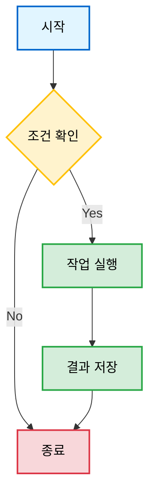
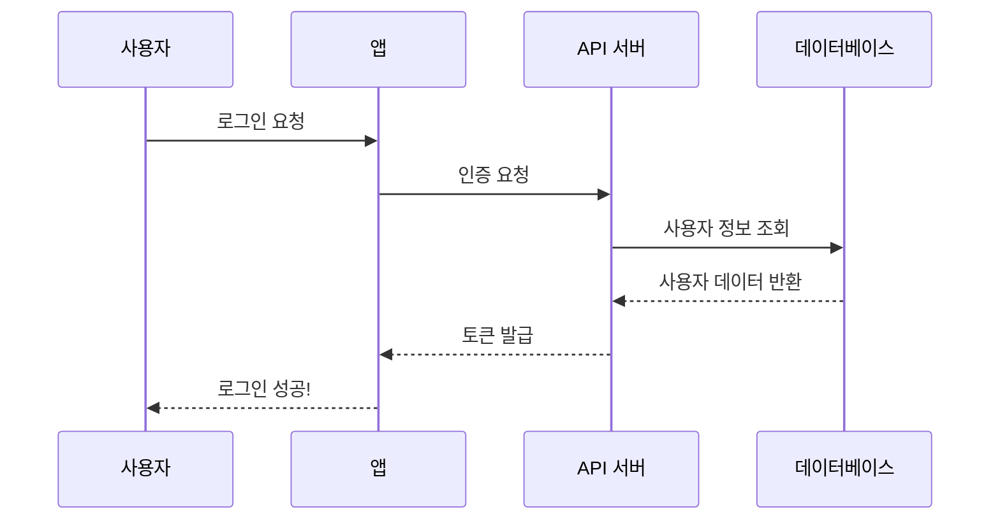
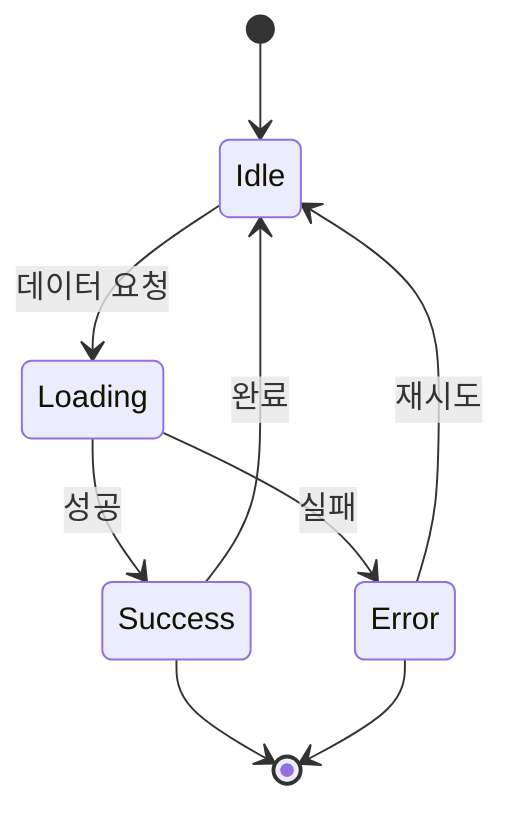
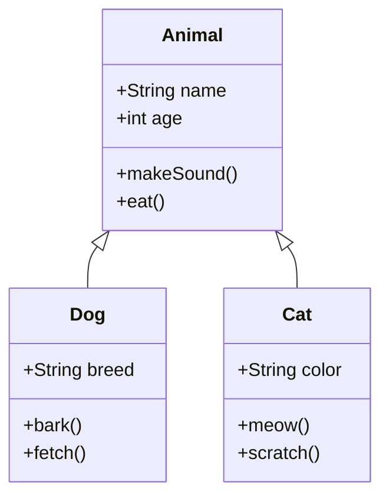
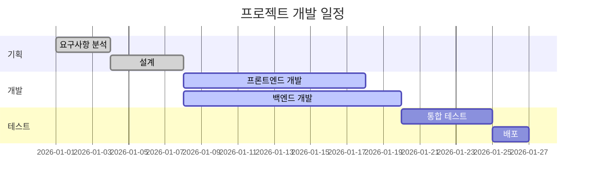
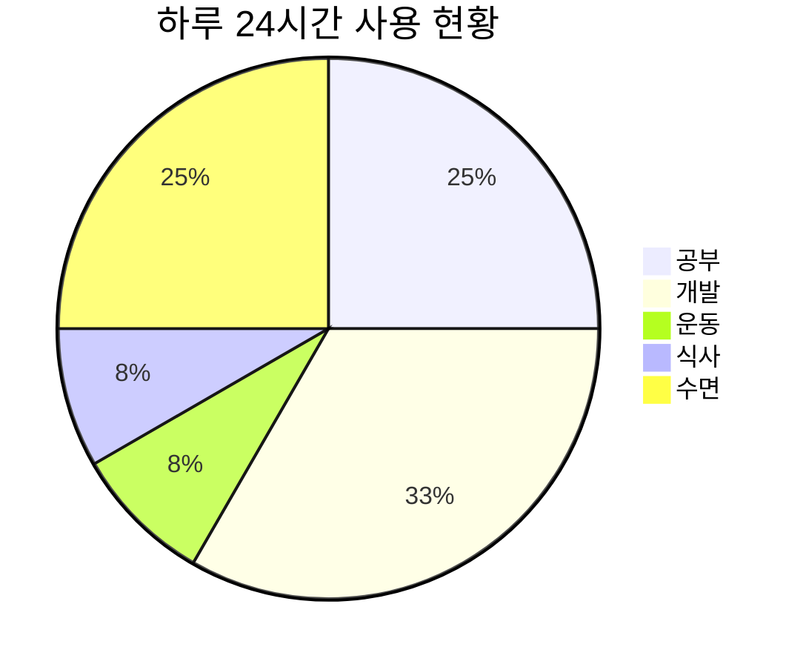
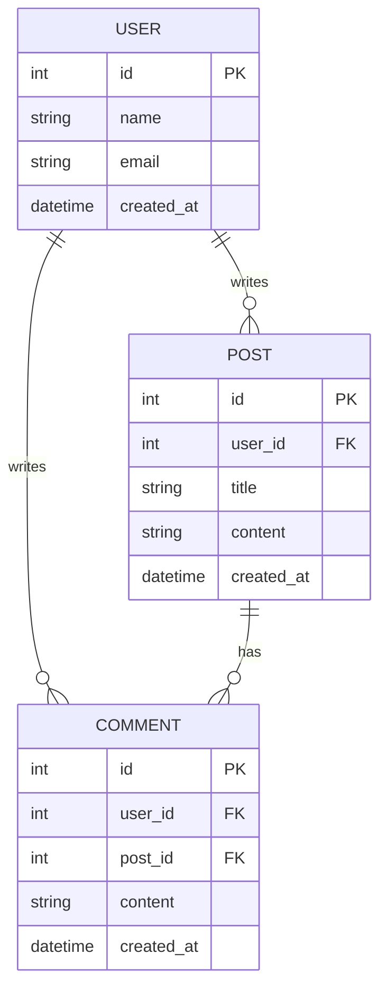
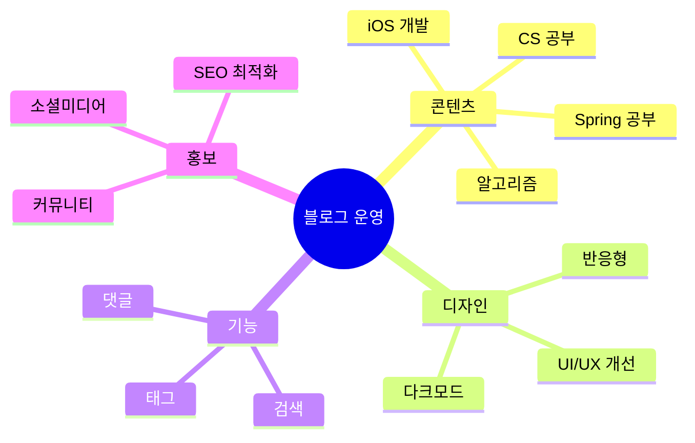
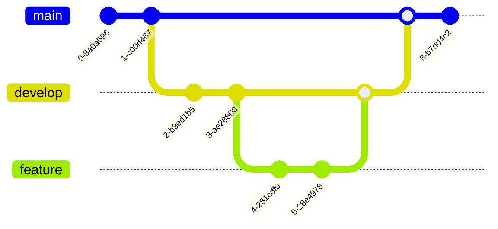

안녕하세욥!

이 포스트는 mermaid 다이어그램이 제대로 렌더링되는지 테스트하기 위한 샘플 포스트임

여러 종류의 다이어그램을 넣어봤으니 잘 나오는지 확인해보자! 👀

 

# 플로우차트(Flowchart)

가장 기본적인 플로우차트부터!

 

# 시퀀스 다이어그램(Sequence Diagram)

사용자와 시스템 간의 인터랙션을 표현해보자!

 

# 상태 다이어그램(State Diagram)

앱의 상태 전환 과정임

 

# 클래스 다이어그램(Class Diagram)

객체 지향 설계를 표현해보자!

 

# 간트 차트(Gantt Chart)

프로젝트 일정 관리용!

 

# 파이 차트(Pie Chart)

비율 표현!

 

# ER 다이어그램(Entity Relationship)

데이터베이스 설계!

 

# 마인드맵(Mind Map)

아이디어 정리용!

 

# 깃 그래프(Git Graph)

Git 브랜치 전략 시각화!

 

.

.

.

오늘은 mermaid 다이어그램 렌더링 테스트를 해봤음

여러 종류의 다이어그램들이 제대로 나온다면 성공! 🎉

포스트 작성할 때 이런 다이어그램들을 활용하면 훨씬 이해하기 쉬울 듯 ㅎㅎ

 

다이어그램이 제대로 안 나온다면... 설정을 다시 봐야겠지? 👀

피드백 대환영!

