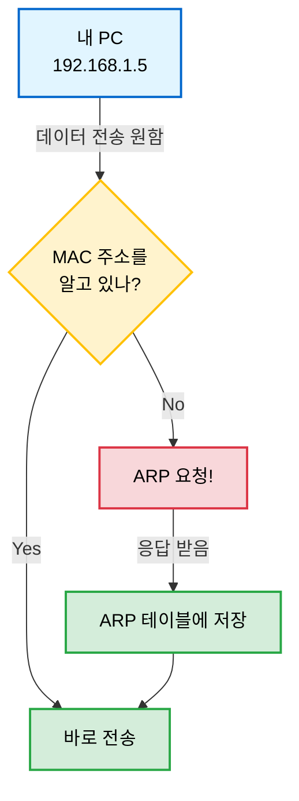
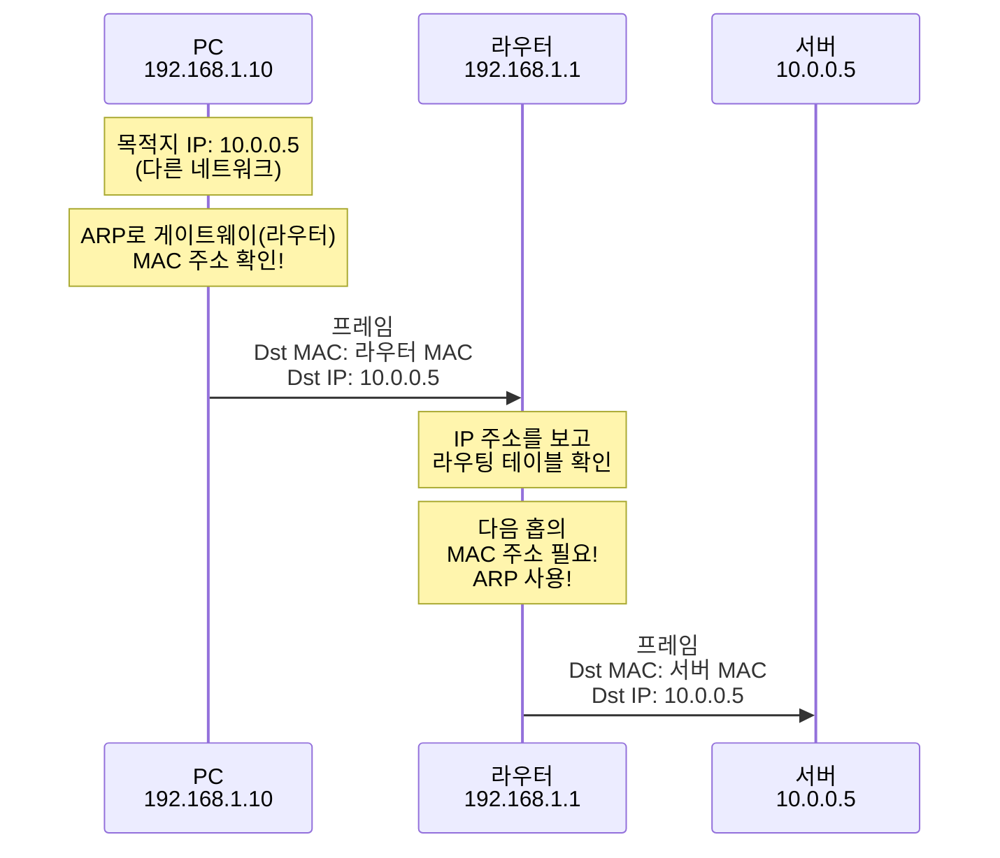
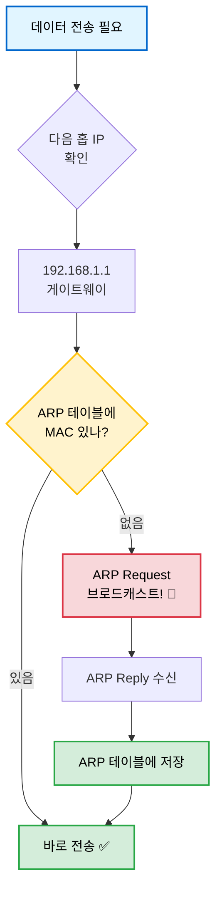
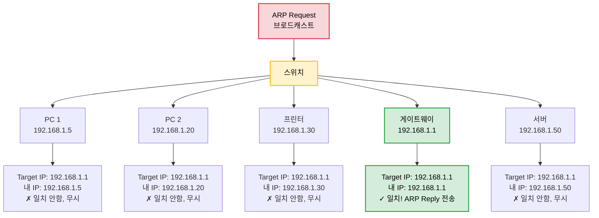
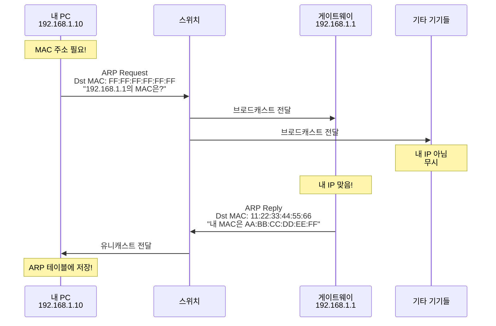
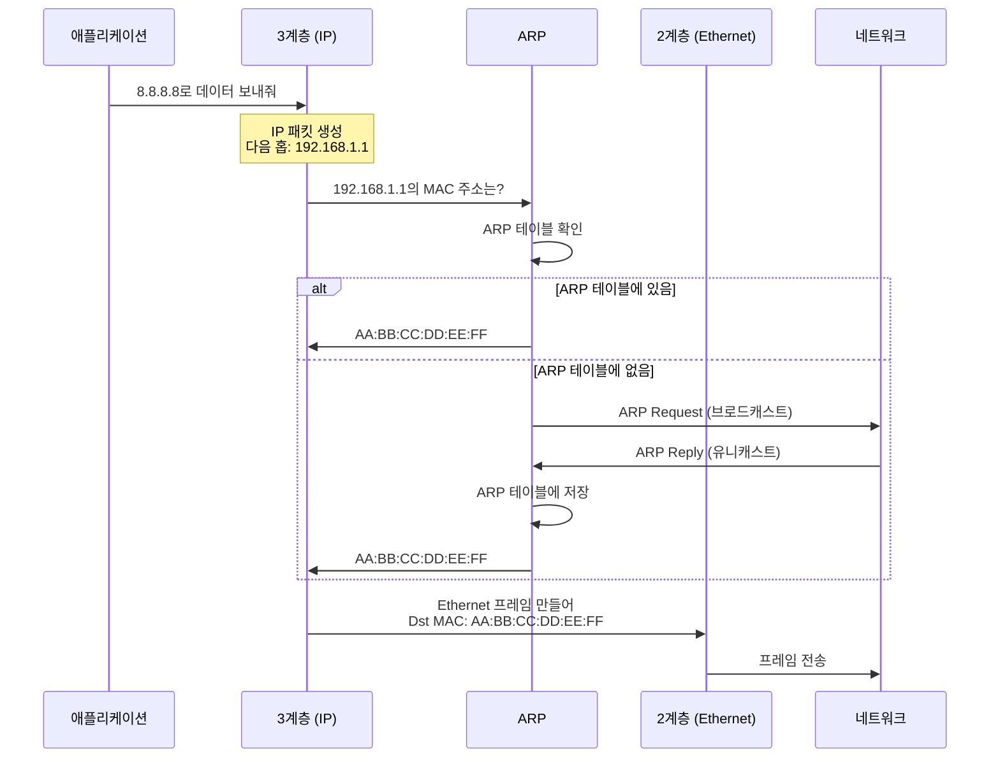
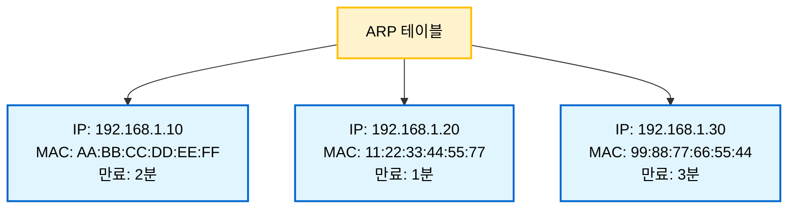
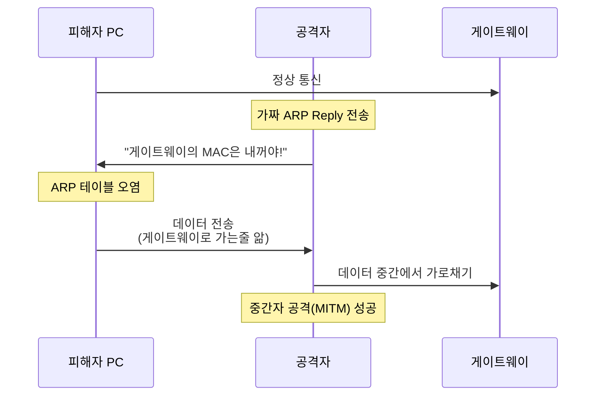
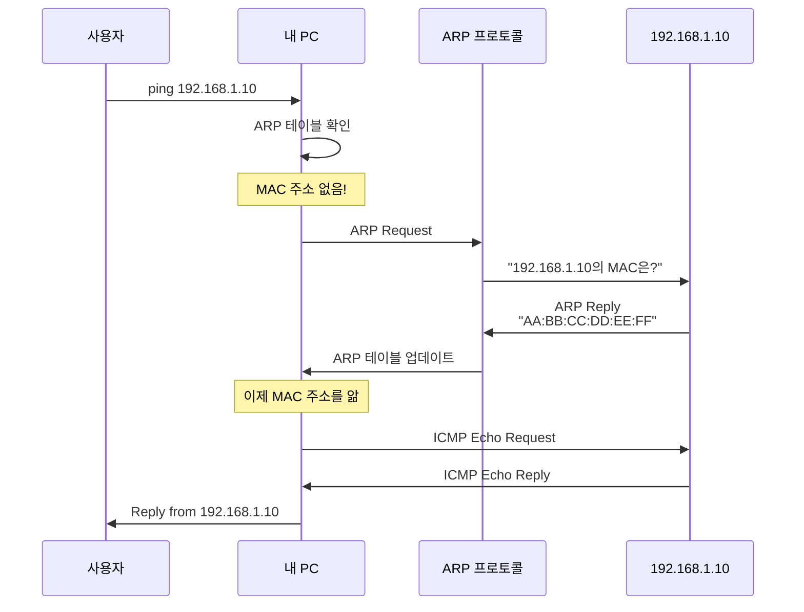

오늘은 ARP(Address Resolution Protocol)에 대해 공부한걸 정리해 보겠습니답!

# ARP란 무엇인가?

**ARP(Address Resolution Protocol)**는 IP 주소를 MAC 주소로 변환해주는 프로토콜임

 

쉽게 말하자면,

"192.168.1.10이라는 IP 주소를 가진 컴퓨터의 물리적 주소(MAC 주소)가 뭐야?"

라고 물어보고 답을 받는 과정이 바로 ARP임

 


 

# 왜 필요한가? 🤔

## IP 주소 vs MAC 주소

먼저 두 주소의 차이를 알아야 함!

 

|              | IP 주소                    | MAC 주소                     |
|--------------|---------------------------|----------------------------|
| **계층**      | 3계층 (Network Layer)      | 2계층 (Data Link Layer)     |
| **형태**      | 192.168.1.10             | AA:BB:CC:DD:EE:FF          |
| **특징**      | 논리적 주소, 변경 가능         | 물리적 주소, 변경 불가(고정)     |
| **용도**      | 네트워크 간 라우팅            | 같은 네트워크 내 기기 식별       |
| **비유**      | 우편 주소                   | 주민등록번호                   |

 

## 문제 상황

내 컴퓨터(192.168.1.5)에서 같은 네트워크에 있는 다른 컴퓨터(192.168.1.10)에게 데이터를 보내고 싶음

 

하지만!

- **3계층(네트워크 계층)**: IP 주소로 목적지를 찾음
- **2계층(데이터링크 계층)**: MAC 주소로 실제 전달함

 

즉, IP 주소만 알고 있어서는 데이터를 실제로 전달할 수 없음!

스위치는 MAC 주소를 보고 프레임을 전달하기 때문

 

**"IP 주소는 알지만 MAC 주소를 모르는 상황"** → 이때 ARP가 필요함!

 



 

## 라우터도 MAC 주소가 필요하다! 🔥

여기서 중요한 포인트!

 

많은 사람들이 "스위치는 MAC 주소를 보고, 라우터는 IP 주소만 본다"고 생각하는데

**라우터도 MAC 주소를 사용함!**

 

### 스위치 vs 라우터

|         | 스위치 (L2)            | 라우터 (L3)                    |
|---------|----------------------|------------------------------|
| **계층** | 2계층 (Data Link)     | 3계층 (Network)               |
| **보는 주소** | MAC 주소만           | **IP 주소 + MAC 주소** ⭐      |
| **역할** | MAC으로 프레임 전달     | IP로 경로 결정, MAC으로 실제 전송 |
| **단위** | 프레임(Frame)         | 패킷(Packet)                  |

 

### 라우터의 실제 동작

라우터가 패킷을 전달할 때:

1. **IP 주소를 보고** → 어느 네트워크로 갈지 결정 (라우팅)
2. **MAC 주소로** → 실제 물리적 전송 (다음 홉의 MAC 주소 필요)

 

즉, 라우터도 **ARP를 사용**해서 다음 홉(Next Hop)의 MAC 주소를 알아내야 함!

 

### 다른 네트워크로 통신하는 과정

PC(192.168.1.10)에서 서버(10.0.0.5)로 데이터를 보낼 때:

 



 

### 핵심 개념 정리

**1단계: PC → 라우터**
- IP Header: Src IP = 192.168.1.10, **Dst IP = 10.0.0.5** (목적지, 변하지 않음)
- Ethernet Header: Src MAC = PC MAC, **Dst MAC = 라우터 MAC** (ARP로 찾음)

**2단계: 라우터 → 서버**
- IP Header: Src IP = 192.168.1.10, **Dst IP = 10.0.0.5** (여전히 그대로)
- Ethernet Header: Src MAC = 라우터 MAC, **Dst MAC = 서버 MAC** (ARP로 찾음)

 

**중요한 점:**
- **IP 주소는 종단 간(End-to-End) 유지** → 출발지부터 목적지까지 변하지 않음
- **MAC 주소는 홉(Hop)마다 변경** → 각 구간을 지날 때마다 바뀜

 


 

이게 바로 **ARP가 네트워크 통신에 필수적인 이유**임!

라우터든 스위치든, 결국 물리적으로 데이터를 전송할 때는 MAC 주소가 필요하니까 👀

 

# ARP 동작 과정

ARP는 **브로드캐스트**와 **유니캐스트** 방식을 사용함

 

## 전체 흐름 이해하기

데이터를 보내기 전 상황을 먼저 이해해보자!

 

### 3계층에서의 고민

```
내 PC (192.168.1.10)가 다른 서버(8.8.8.8)로 데이터를 보내려고 함

[3계층 - Network Layer]
└─ IP 패킷 준비 완료
   ├─ Src IP: 192.168.1.10
   └─ Dst IP: 8.8.8.8 (최종 목적지)

└─ 라우팅 판단: "8.8.8.8은 다른 네트워크네? 게이트웨이(192.168.1.1)로 보내야지!"
└─ 다음 홉(Next Hop) 결정: 192.168.1.1 ✅

[2계층 - Data Link Layer]
└─ Ethernet 프레임을 만들려는데...
   ├─ Src MAC: 내 MAC (알고 있음)
   └─ Dst MAC: ??? (192.168.1.1의 MAC 주소를 모름!)
   
문제 발생! 🚨
"3계층에서는 다음 홉 IP를 알지만, 2계층에서는 MAC 주소가 필요함!"
```

 

### ARP 테이블 확인

MAC 주소를 모르면 일단 **ARP 테이블(ARP Cache)**부터 확인함!

 

```bash
$ arp -a

Internet Address      Physical Address      Type
192.168.1.5          11:22:33:44:55:66     dynamic
192.168.1.20         aa:bb:cc:dd:ee:ff     dynamic
# 192.168.1.1이 없네? ARP Request 해야 함!
```

 



 

## 1. ARP Request (브로드캐스트)

MAC 주소를 모르면, 같은 네트워크의 **모든 기기에게** 물어봄!

 

### 브로드캐스트 메시지

> "같은 네트워크에 연결된 모든 기기들아!
> IP 주소 192.168.1.1을 가진 기기가 있니?
> 있으면 너의 MAC 주소 좀 알려줘!"

 

### ARP Request 패킷 구조

```
ARP Request:
┌──────────────────────────────┐
│ Ethernet Header              │
│  Dst MAC: FF:FF:FF:FF:FF:FF  │ ← 브로드캐스트 주소!
│  Src MAC: 11:22:33:44:55:66  │ ← 내 MAC
├──────────────────────────────┤
│ ARP Packet                   │
│  Operation: Request (1)      │
│  Sender MAC: 11:22:33:44:55:66│
│  Sender IP: 192.168.1.10     │
│  Target MAC: 00:00:00:00:00:00│ ← 모름 (찾는 중)
│  Target IP: 192.168.1.1      │ ← 찾으려는 IP
└──────────────────────────────┘
```

 

`FF:FF:FF:FF:FF:FF`는 특수한 MAC 주소로, **브로드캐스트**를 의미함

스위치가 이 주소를 보면 연결된 모든 포트로 프레임을 전달함!

 

### 모든 기기가 받지만... 



 

**중요 포인트:**
- 📡 브로드캐스트로 **모든 연결된 기기**에게 전달됨 (PC, 서버, 프린터, 라우터 등)
- 👀 모든 기기가 패킷을 받아서 확인함
- ✅ **해당 IP를 가진 기기만** ARP Reply로 응답함
- ❌ 나머지 기기들은 조용히 무시함

 

## 2. ARP Reply (유니캐스트)

해당 IP 주소를 가진 기기(게이트웨이)만 응답함!

 

### 유니캐스트 메시지

> "나 192.168.1.1이야! 
> 내 MAC 주소는 AA:BB:CC:DD:EE:FF야!"

 

### ARP Reply 패킷 구조

```
ARP Reply:
┌──────────────────────────────┐
│ Ethernet Header              │
│  Dst MAC: 11:22:33:44:55:66  │ ← 요청자 MAC (유니캐스트!)
│  Src MAC: AA:BB:CC:DD:EE:FF  │ ← 게이트웨이 MAC
├──────────────────────────────┤
│ ARP Packet                   │
│  Operation: Reply (2)        │
│  Sender MAC: AA:BB:CC:DD:EE:FF│
│  Sender IP: 192.168.1.1      │
│  Target MAC: 11:22:33:44:55:66│
│  Target IP: 192.168.1.10     │
└──────────────────────────────┘
```

 

이번엔 특정 MAC 주소로 보내기 때문에 **요청한 PC에게만** 전달됨!

 



 

## 3. ARP 테이블 업데이트

ARP Reply를 받으면 **ARP 테이블(ARP Cache)**에 저장함!

 

```bash
$ arp -a

Internet Address      Physical Address      Type      TTL
192.168.1.1          aa:bb:cc:dd:ee:ff     dynamic   120초  ← 새로 추가됨!
192.168.1.5          11:22:33:44:55:66     dynamic   180초
192.168.1.20         aa:bb:cc:dd:ee:ff     dynamic   90초
```

 

이제 다음번에는 ARP Request 없이 바로 전송 가능! ⚡

(일정 시간(보통 2~20분) 후에는 자동으로 삭제되어 다시 물어봄)

 

## 4. 드디어 데이터 전송!

이제 MAC 주소를 알았으니 프레임을 완성해서 전송할 수 있음!

 

```
Ethernet 프레임:
┌─────────────────────────────┐
│ Ethernet Header             │
│  Src MAC: 11:22:33:44:55:66 │ ← 내 MAC
│  Dst MAC: AA:BB:CC:DD:EE:FF │ ← 게이트웨이 MAC (ARP로 획득!)
├─────────────────────────────┤
│ IP Packet                   │
│  Src IP: 192.168.1.10       │
│  Dst IP: 8.8.8.8            │ ← 최종 목적지 IP (그대로!)
│  Data: ...                  │
└─────────────────────────────┘

→ 게이트웨이로 전송 완료! ✅
```

 

**핵심:**
- MAC 주소: 게이트웨이 (다음 홉)
- IP 주소: 최종 목적지 서버
- 이후 게이트웨이가 라우팅해서 최종 목적지까지 전달함!

 

## 전체 과정 요약



 

# ARP 패킷 상세 구조

참고로, ARP 패킷의 상세 구조는 다음과 같음:

 

**ARP Request 패킷**
- Operation: 1 (Request)
- Sender MAC: 11:22:33:44:55:66 (내 MAC)
- Sender IP: 192.168.1.5 (내 IP)
- Target MAC: 00:00:00:00:00:00 (모름, 찾는 중)
- Target IP: 192.168.1.10 (찾으려는 IP)

 

**ARP Reply 패킷**
- Operation: 2 (Reply)
- Sender MAC: AA:BB:CC:DD:EE:FF (응답자의 MAC)
- Sender IP: 192.168.1.10 (응답자의 IP)
- Target MAC: 11:22:33:44:55:66 (요청자의 MAC)
- Target IP: 192.168.1.5 (요청자의 IP)

 

# ARP 테이블 (ARP Cache)

매번 ARP 요청을 보내면 비효율적이잖아?

그래서 **ARP 테이블**이라는 캐시에 저장해둠!

 



 

## ARP 테이블 확인 방법

**Windows**
```bash
arp -a
```

**macOS / Linux**
```bash
arp -a
# 또는
ip neigh show
```

 

## 출력 예시

```
Internet Address      Physical Address      Type
192.168.1.1          a0-b1-c2-d3-e4-f5     dynamic
192.168.1.10         aa-bb-cc-dd-ee-ff     dynamic
192.168.1.20         11-22-33-44-55-66     dynamic
```

 

**Type 의미:**
- **dynamic**: ARP로 자동 학습, 일정 시간 후 삭제 (보통 2~20분)
- **static**: 수동으로 등록, 재부팅 전까지 유지

 

# ARP의 특징과 문제점

## 🌞 장점

1. **자동화**: 사용자가 신경 쓸 필요 없이 자동으로 동작
2. **효율성**: 캐시를 통해 반복 요청 방지
3. **단순함**: 프로토콜이 간단하고 오버헤드가 적음

 

## 🌚 단점 및 보안 문제

### 1. ARP Spoofing (ARP 스푸핑)

악의적인 공격자가 가짜 ARP Reply를 보내서

다른 기기의 MAC 주소를 자신의 MAC 주소로 속이는 공격

 



 

### 2. ARP Storm

네트워크에 ARP 요청이 과도하게 발생해 성능 저하

 

### 3. 보안 대책

- **정적 ARP 엔트리**: 중요한 서버의 IP-MAC 매핑을 고정
- **ARP 스푸핑 탐지 도구**: Arpwatch, XArp 등
- **스위치 보안 기능**: Dynamic ARP Inspection (DAI)
- **암호화 통신**: HTTPS, VPN 등으로 데이터 보호

 

# RARP (Reverse ARP) - 역으로!

ARP의 반대 개념도 있음!

 

**RARP**: MAC 주소로 IP 주소를 찾는 프로토콜

 


 

**사용 사례:**
- 디스크가 없는 워크스테이션이 부팅할 때
- 네트워크 카드만 있고 IP를 모를 때

 

하지만 요즘은 **DHCP**가 이 역할을 대체해서 거의 안 씀!

 

# 실전 예시: ping 명령어와 ARP

우리가 자주 쓰는 `ping` 명령어를 실행하면 내부적으로 ARP가 동작함!

 

## 시나리오

```bash
ping 192.168.1.10
```

 

## 내부 동작 과정



 

## 실제 확인해보기

**1단계: ARP 테이블 비우기**
```bash
# Windows
arp -d

# macOS/Linux
sudo arp -d -a
```

 

**2단계: ping 실행**
```bash
ping 192.168.1.10
```

 

**3단계: ARP 테이블 확인**
```bash
arp -a
```

 

짜잔! 192.168.1.10의 MAC 주소가 자동으로 추가되어 있을 것임 🎉

 

# 정리

오늘은 ARP(Address Resolution Protocol)에 대해 알아봤음

 

**핵심 포인트:**
- ARP는 **IP 주소 → MAC 주소** 변환 프로토콜
- **ARP Request**(브로드캐스트) → **ARP Reply**(유니캐스트) 과정
- **ARP 테이블**에 캐싱하여 효율성 향상
- 보안에 취약해서 **ARP Spoofing** 공격 주의 필요

 

**참고**
- [RFC 826 - An Ethernet Address Resolution Protocol](https://www.rfc-editor.org/rfc/rfc826)