오늘은 DHCP와 NAT에 대해 공부한걸 정리해봄

와이파이만 연결하면 자동으로 인터넷이 되는데, 그 뒤에서는 무슨 일이 일어나는걸까

그리고 우리 집 공유기 하나로 여러 기기가 인터넷을 쓸 수 있는 이유는 뭘까

이 두 가지 질문의 답이 바로 **DHCP**와 **NAT**임!


 

# DHCP(Dynamic Host Configuration Protocol)

## DHCP란 무엇인가?

**DHCP**는 네트워크에 연결된 기기에게 **자동으로 IP 주소를 할당**해주는 프로토콜

 

쉽게 말하자면,

"너 IP 주소 없지? 잠깐만 기다려, 내가 하나 줄게!"

라고 하는 친절한 자동 배정 시스템이다.

 

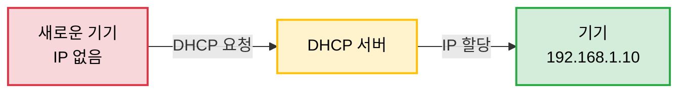

 

### DHCP가 없었던 시절...

옛날에는 네트워크 관리자가 일일이 손으로 IP 주소를 설정해줬음

 

**문제점들:**

1. **엄청 귀찮음** - 1000대 컴퓨터에 하나하나 IP 설정? 
2. **IP 충돌** - 실수로 같은 IP를 두 대에 설정하면 충돌!
3. **관리 지옥** - 누가 어떤 IP 쓰는지 엑셀로 관리...
4. **손님 접속 불편** - 카페 손님마다 IP 설정해주기?

 

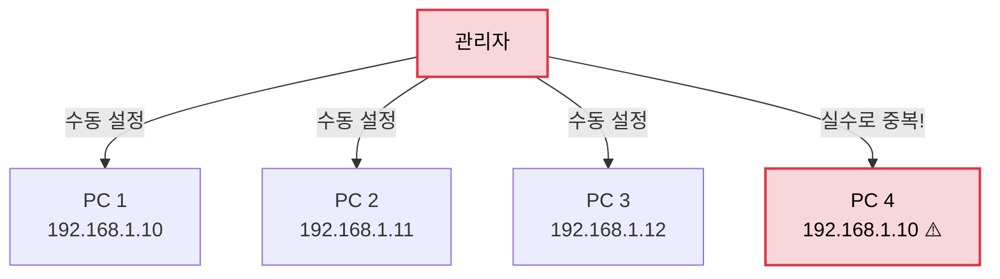

 

### DHCP가 해결해준 것들

1. **자동화** - 네트워크에 연결만 하면 자동으로 IP 할당
2. **중복 방지** - 이미 사용 중인 IP는 절대 안 줌
3. **효율적 관리** - IP 주소 풀을 중앙에서 관리
4. **임대 방식** - 안 쓰는 IP는 회수해서 재사용

 

## DHCP 구성 요소

### 1. DHCP 서버

IP 주소를 관리하고 할당해주는 녀석

보통 공유기(라우터)가 DHCP 서버 역할을 함!

 

**관리하는 정보:**
- **IP 주소 풀**: 할당 가능한 IP 범위 (예: 192.168.1.100 ~ 192.168.1.200)
- **서브넷 마스크**: 네트워크 구분용
- **게이트웨이**: 외부 네트워크로 나가는 문
- **DNS 서버**: 도메인 이름을 IP로 변환
- **임대 시간**: IP를 빌려주는 기간

 

### 2. DHCP 클라이언트

IP 주소가 필요한 기기 (PC, 스마트폰, 노트북 등)

 

### 3. IP 주소 풀(Pool)

할당 가능한 IP 주소들의 범위

예: 192.168.1.100 ~ 192.168.1.200 (총 101개)

 

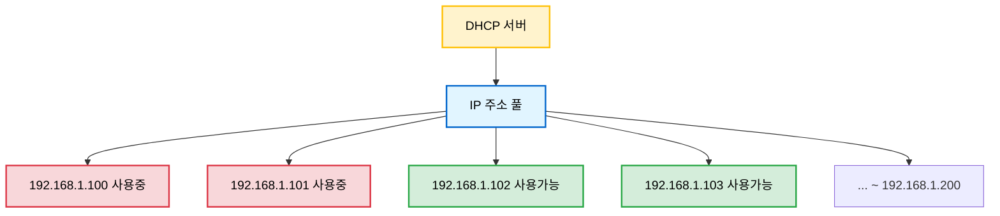

 

## DHCP 동작 과정 - DORA

DHCP는 **DORA** 4단계로 동작함! 도라방스

**D**iscover → **O**ffer → **R**equest → **A**cknowledge


 
### 전체 흐름

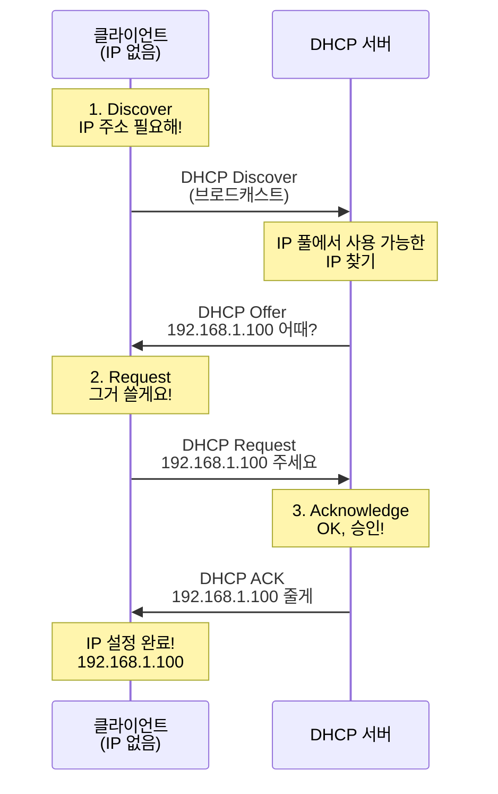

 

### 1단계: DHCP Discover (발견)

클라이언트가 네트워크에 처음 연결되면, "DHCP 서버 어디 있어요?" 하고 외침

 

**특징:**
- **브로드캐스트** 방식 (FF:FF:FF:FF:FF:FF)
- 모든 기기에게 전송됨
- 아직 IP가 없으니까 Src IP는 0.0.0.0

 

```
DHCP Discover 패킷:
┌──────────────────────────────────┐
│ Ethernet Header                  │
│  Src MAC: AA:BB:CC:DD:EE:FF      │ ← 내 MAC
│  Dst MAC: FF:FF:FF:FF:FF:FF      │ ← 브로드캐스트
├──────────────────────────────────┤
│ IP Header                        │
│  Src IP: 0.0.0.0                 │ ← IP 없음
│  Dst IP: 255.255.255.255         │ ← 브로드캐스트
├──────────────────────────────────┤
│ DHCP Message                     │
│  Type: Discover                  │
│  Client MAC: AA:BB:CC:DD:EE:FF   │
│  "DHCP 서버, IP 주세요!"          │ 
└──────────────────────────────────┘
```

 

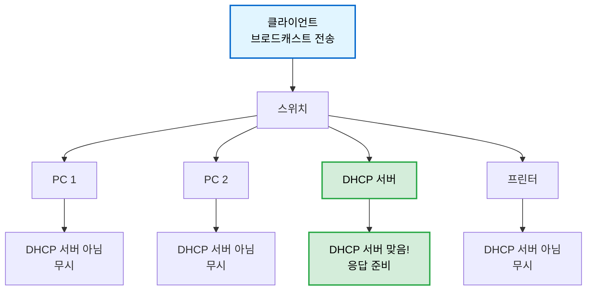

 

### 2단계: DHCP Offer (제안)

DHCP 서버가 "이 IP 어때?" 하고 제안함

 

**특징:**
- 유니캐스트 또는 브로드캐스트로 응답
- IP 주소 + 서브넷 마스크 + 게이트웨이 + DNS 등 포함
- 임대 시간(Lease Time)도 함께 알려줌

 

```
DHCP Offer 패킷:
┌────────────────────────────────────┐
│ DHCP Message                       │
│  Type: Offer                       │
│  Offered IP: 192.168.1.100         │ ← 제안하는 IP
│  Subnet Mask: 255.255.255.0        │
│  Gateway: 192.168.1.1              │
│  DNS: 8.8.8.8                      │
│  Lease Time: 86400초 (24시간)      │
│  "이거 쓸래?"                       │
└────────────────────────────────────┘
```

 

**여러 DHCP 서버가 있다면?**

네트워크에 DHCP 서버가 여러 개면, 각자 Offer를 보냄

클라이언트는 보통 **먼저 도착한 Offer**를 선택함!

 

### 3단계: DHCP Request (요청)

클라이언트가 "그 IP 쓸게요!" 하고 공식 요청함

 

**특징:**
- 다시 **브로드캐스트**로 전송 (모든 DHCP 서버에게 알림)
- "나 이 서버의 IP 쓸 거야!" 라고 공표
- 다른 DHCP 서버들은 "아 알았어" 하고 Offer 취소

 

```
DHCP Request 패킷:
┌──────────────────────────────────┐
│ DHCP Message                     │
│  Type: Request                   │
│  Requested IP: 192.168.1.100     │
│  Server IP: 192.168.1.1          │
│  "192.168.1.100 주세요!"          │
└──────────────────────────────────┘
```

 

### 4단계: DHCP Acknowledge (확인)

DHCP 서버가 "OK! 승인!" 하고 최종 확인

 

**특징:**
- 정식으로 IP 주소 임대 시작
- 클라이언트는 이제 해당 IP를 사용 가능
- 임대 시간 동안 IP 독점 사용 보장

 

```
DHCP ACK 패킷:
┌────────────────────────────────────┐
│ DHCP Message                       │
│  Type: ACK                         │
│  Your IP: 192.168.1.100            │
│  Subnet Mask: 255.255.255.0        │
│  Gateway: 192.168.1.1              │
│  DNS: 8.8.8.8, 8.8.4.4             │
│  Lease Time: 86400초               │
│  "승인! 써도 돼!"                   │
└────────────────────────────────────┘
```

 

짜잔! 이제 클라이언트는 정상적으로 네트워크 통신 가능

 


 

## IP 주소 임대(Lease)

DHCP는 IP를 **빌려주는** 방식임!

영구적으로 주는 게 아니라 **일정 시간 동안만** 사용 가능함

 

### 임대 시간(Lease Time)

보통 24시간(86400초) 정도로 설정됨

- 집: 24시간 ~ 7일
- 회사: 8시간 ~ 24시간
- 카페: 1시간 ~ 4시간

 

### 임대 갱신 과정

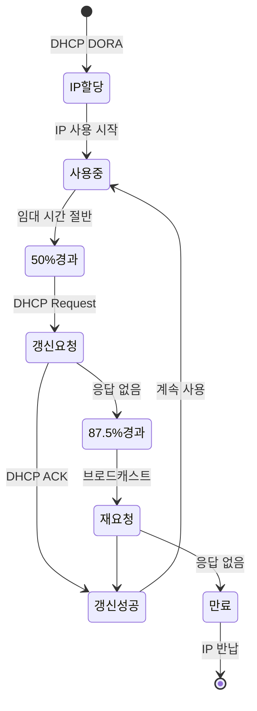

 

**임대 갱신 타임라인:**

```
임대 시작 (0%)
    ↓
50% 시점: 갱신 시도 (DHCP Request → 원래 서버)
    ↓
87.5% 시점: 갱신 재시도 (브로드캐스트 → 아무 서버나)
    ↓
100% 시점: 임대 만료, IP 사용 불가
```

 

클라이언트가 계속 네트워크에 연결되어 있으면, 자동으로 갱신

우리가 신경 쓸 필요 없이 알아서 처리된다.

 

### IP 주소 반납

기기를 종료하거나 네트워크에서 분리되면, IP 주소를 반납함

그럼 DHCP 서버는 그 IP를 다시 풀(Pool)에 넣어서 다른 기기에게 줄 수 있음!

 

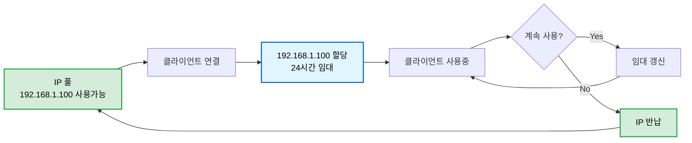

 

## DHCP의 장단점

### 장점

1. **편리함** - 자동으로 IP 할당, 사용자는 신경 쓸 필요 없음
2. **효율적** - 안 쓰는 IP 회수해서 재사용
3. **중복 방지** - IP 충돌 걱정 없음
4. **중앙 관리** - 네트워크 설정을 한곳에서 관리
5. **확장성** - 새 기기 추가가 쉬움

 

### 단점

1. **DHCP 서버 의존** - 서버 다운되면 새로운 기기 접속 불가
2. **보안 취약점** - 가짜 DHCP 서버(Rogue DHCP) 공격 가능
3. **고정 IP 필요한 경우** - 서버 같은 경우는 DHCP 부적합

 

## DHCP 실전 활용

### 집에서의 DHCP

우리 집 공유기가 바로 DHCP 서버임!

 

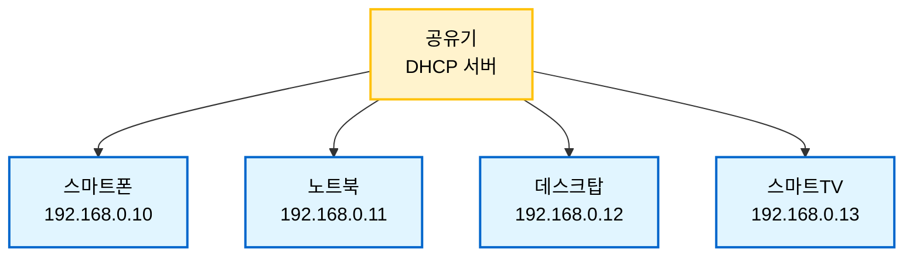

 

### 카페에서의 DHCP

카페 와이파이도 DHCP 덕분에 비밀번호만 입력하면 바로 접속됨!

손님마다 IP 설정해주는 직원은 없잖아?

 

### 회사에서의 DHCP

대규모 네트워크에서는 전용 DHCP 서버를 따로 둠

수백~수천 대의 PC를 자동으로 관리함!

 

## DHCP 주소 예약(Reservation)

특정 기기에게 **항상 같은 IP**를 주고 싶을 때 사용함

 

예: 프린터는 항상 192.168.1.50을 쓰게 설정

- MAC 주소를 기준으로 예약
- DHCP의 편리함 + 고정 IP의 안정성

 

```
DHCP 주소 예약 설정:
┌────────────────────────────────────────┐
│ MAC Address           IP Address       │
│ AA:BB:CC:DD:EE:FF    192.168.1.50      │ ← 프린터
│ 11:22:33:44:55:66    192.168.1.51      │ ← 서버
└────────────────────────────────────────┘
```

 

---

 

# NAT(Network Address Translation)

## NAT란 무엇인가?

**NAT**는 **IP 주소를 변환**해주는 기술임

 

쉽게 말하자면,

"우리 집 내부 주소(사설 IP)를 외부 주소(공인 IP)로 바꿔주는 통역사" 같은 존재임

 

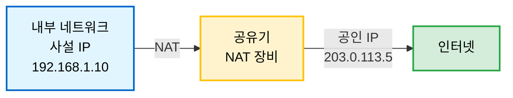

 

## 왜 필요한가? 🤔

### IPv4 주소 고갈 문제

IPv4 주소는 총 **약 43억 개**밖에 없음

전 세계 인구가 80억 명이고, 한 사람당 여러 기기를 쓰는데...

**IP 주소가 부족함!** 

 

```
IPv4 주소 총 개수: 2^32 = 4,294,967,296 개
전 세계 인구: 약 8,000,000,000 명
기기 수: 인당 5개 이상 (PC, 폰, 태블릿, TV, IoT...)

→ IP 주소 부족 문제 심각!
```

 

### NAT의 해결책

**사설 IP**(Private IP)를 사용해서, 한 개의 **공인 IP**(Public IP)로 여러 기기가 인터넷 사용!

 

우리 집 공유기가 하나의 공인 IP를 받고,

집 안의 여러 기기는 사설 IP를 사용하는 것임

 

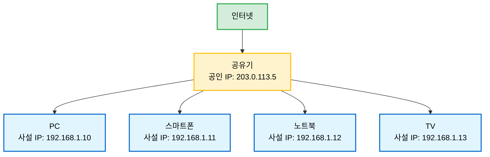

 

## 사설 IP vs 공인 IP

### 사설 IP (Private IP)

내부 네트워크에서만 사용하는 IP 주소

**인터넷에서는 사용 불가!**

 

**사설 IP 대역:**
- Class A: `10.0.0.0` ~ `10.255.255.255`
- Class B: `172.16.0.0` ~ `172.31.255.255`
- Class C: `192.168.0.0` ~ `192.168.255.255` ← 집에서 주로 이거 씀!

 

### 공인 IP (Public IP)

전 세계에서 유일한 IP 주소

**인터넷 통신에 필수!**

ISP(통신사)가 할당해줌

 

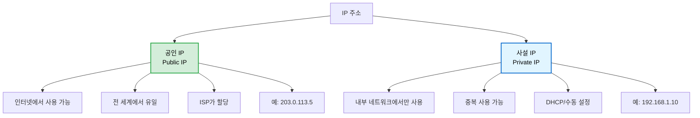

 

## NAT 동작 원리

NAT는 **NAT 테이블**을 사용해서 주소를 변환함!

 

### 포트 번호란?

먼저 포트 번호 간단쓰하게 정리하고 가보자잇


각 기기가 인터넷 통신할 때, **IP 주소 + 포트 번호** 조합을 사용함

 

```
192.168.1.10:12345
     ↑         ↑
   IP 주소   포트 번호
```

 

**포트 번호의 종류:**
- **0~1023**: 잘 알려진 포트 (웹 서버 80, HTTPS 443, SSH 22 등)
- **1024~49151**: 등록된 포트
- **49152~65535**: 동적 포트 (Ephemeral Port) ← **클라이언트가 사용!**

 

내가 구글에 접속하면, 운영체제가 자동으로 **49152~65535 범위에서 랜덤 포트**를 선택함

예: `192.168.1.10:58234` ← 58234가 자동 선택된 포트!

 

### 여러 기기가 동시에 사용하는 상황

집에 PC 3대가 있고, 모두 동시에 구글에 접속한다고 가정해보자!

 

**각 PC가 사용하는 주소:**
```
PC 1: 192.168.1.10:12345  ← 12345는 PC1이 랜덤으로 선택한 포트
PC 2: 192.168.1.11:23456  ← 23456는 PC2가 랜덤으로 선택한 포트
PC 3: 192.168.1.12:34567  ← 34567는 PC3이 랜덤으로 선택한 포트
```

 

이 3대가 **공인 IP는 하나**만 있는데 어떻게 동시에 인터넷을 쓸까?

바로 NAT가 각각 다른 외부 포트를 할당해주는 거임!

 

### NAT 테이블 생성 과정

**1단계: 요청(Outbound) - 내부 → 외부**

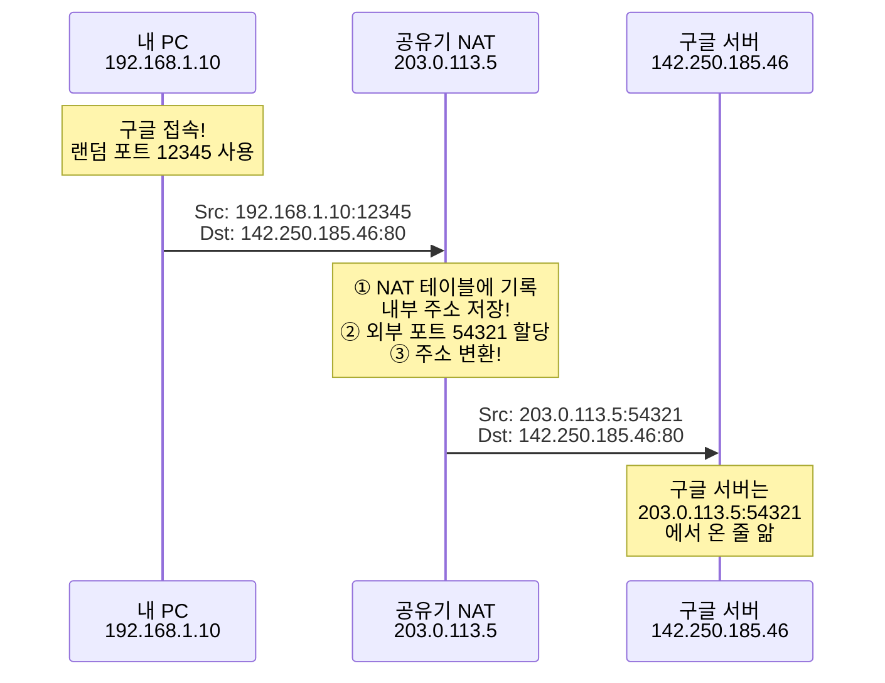

 

**이때 NAT 테이블이 이렇게 만들어짐:**

```
NAT 테이블:
┌──────────────────────────────────────────────────┐
│ 내부 주소              → 외부 주소                 │
├──────────────────────────────────────────────────┤
│ 192.168.1.10:12345    → 203.0.113.5:54321        │
└──────────────────────────────────────────────────┘
```

 

**2단계: 응답(Inbound) - 외부 → 내부**

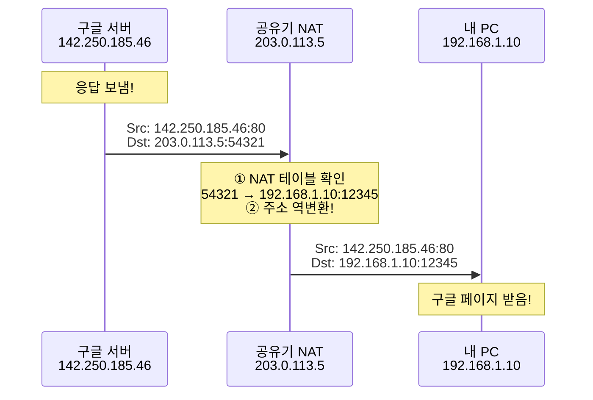

 

**핵심 포인트:**
1. **요청 나갈 때**: 내부 주소 → NAT 테이블에 기록 → 공인 IP로 변환
2. **응답 들어올 때**: NAT 테이블 확인 → 어느 내부 기기인지 찾음 → 내부 주소로 역변환

NAT 테이블이 "양방향 주소록" 역할을 하는 거임!

 

### 여러 기기가 동시에 사용할 때

PC 3대가 동시에 구글에 접속하면?

 

```
NAT 테이블:
┌──────────────────────────────────────────────────┐
│ 내부 주소              → 외부 주소                 │
├──────────────────────────────────────────────────┤
│ 192.168.1.10:12345    → 203.0.113.5:54321        │ ← PC 1
│ 192.168.1.11:23456    → 203.0.113.5:54322        │ ← PC 2
│ 192.168.1.12:34567    → 203.0.113.5:54323        │ ← PC 3
└──────────────────────────────────────────────────┘
```

 

**NAT가 하는 일:**
- PC 1의 요청: 54321번 포트 할당
- PC 2의 요청: 54322번 포트 할당
- PC 3의 요청: 54323번 포트 할당

**외부에서 보면**: 모두 `203.0.113.5`에서 온 것처럼 보이지만, **포트 번호가 다름!**

 

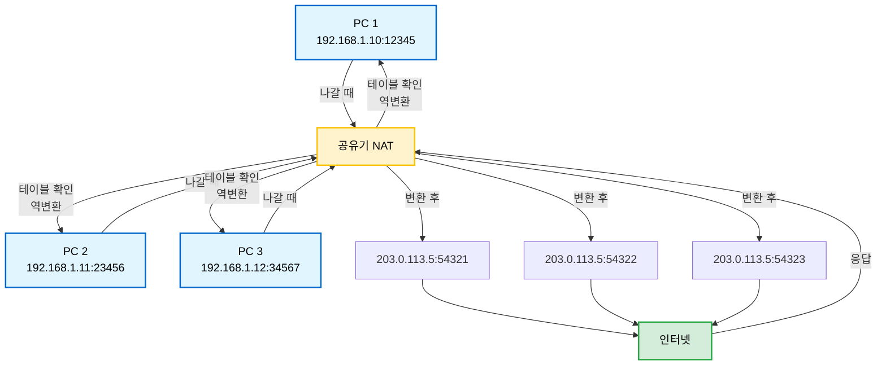

 

**이렇게 하나의 공인 IP로 여러 기기가 동시에 인터넷을 쓸 수 있는 거임!**

 

## NAT의 종류

### 1. Static NAT (정적 NAT)

**1:1 매핑** - 사설 IP 하나를 공인 IP 하나로 고정 매핑

 


 

**사용 사례:**
- 외부에서 접속해야 하는 서버
- 웹 서버, 게임 서버 등

**단점:**
- 공인 IP를 여러 개 필요함 (비쌈!)

**왜 쓰나?**
- 외부에서 내부 서버로 직접 접속이 필요한 경우
- PAT는 내부에서 외부로 먼저 연결해야 NAT 테이블이 생기므로 부적합

 

### 2. Dynamic NAT (동적 NAT)

**N:M 매핑** - 사설 IP 여러 개를 공인 IP 풀에서 동적 할당

 

```
공인 IP 풀: 203.0.113.10 ~ 203.0.113.15 (6개)
사설 IP: 192.168.1.1 ~ 192.168.1.100 (100개)

→ 동시에 최대 6명만 인터넷 사용 가능
```

 

**특징:**
- 선착순으로 공인 IP 할당
- 공인 IP 고갈되면 대기...

**왜 쓰나?**
- 일부 프로토콜이 PAT와 호환되지 않는 경우
- 보안상 각 기기마다 별도 공인 IP가 필요한 경우 (대기업, 정부기관)

 

### 3. PAT (Port Address Translation) = NAT Overload

**N:1 매핑** - 사설 IP 여러 개를 **공인 IP 하나 + 포트 번호**로 구분!

 

**가정과 소규모 사무실에서 주로 사용하는 방식!**

공인 IP 하나로 여러 기기 사용 가능 - Static/Dynamic NAT와 달리 IP 주소를 크게 절약할 수 있음

 

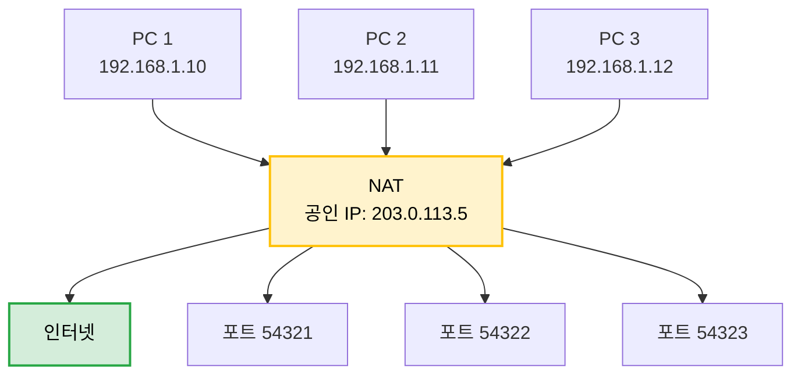

 

**PAT 테이블:**

```
내부                          외부
192.168.1.10:12345    →    203.0.113.5:54321
192.168.1.11:23456    →    203.0.113.5:54322
192.168.1.12:34567    →    203.0.113.5:54323
```

 

**포트 번호로 각 기기를 구분!**

- 이론상 최대 65,535개 포트 사용 가능
- 실제로는 수천 개 동시 연결 가능

 

## NAT의 장단점

### 장점

1. **IP 주소 절약** - 공인 IP 하나로 여러 기기 사용
2. **보안 강화** - 내부 네트워크 구조 숨김 (외부에서 직접 접근 불가)
3. **유연성** - 내부 IP 변경해도 외부에 영향 없음

 

### 단점

1. **End-to-End 통신 방해** - 순수한 종단 간 통신 불가
2. **포트 포워딩 필요** - 외부에서 내부로 접속하려면 설정 필요
3. **일부 프로토콜 문제** - FTP, SIP 등 IP 주소를 데이터에 포함하는 프로토콜은 문제 발생 가능
4. **성능 오버헤드** - 주소 변환 과정에서 약간의 지연

 

## 포트 포워딩(Port Forwarding)

외부에서 내부 서버로 접속하고 싶을 때 사용!

 

### 문제 상황

집에서 게임 서버를 열었는데, 친구들이 접속을 못함

왜? NAT 때문에 외부에서 내부로 들어오는 연결이 차단됨!

 

### 해결책: 포트 포워딩

공유기 설정에서 특정 포트를 특정 내부 기기로 연결해줌

 


 

**포트 포워딩 설정 예시:**

```
외부 포트    →    내부 IP          내부 포트
25565      →    192.168.1.50     25565     (게임 서버)
80         →    192.168.1.51     80        (웹 서버)
22         →    192.168.1.52     22        (SSH)
```

 

## DHCP와 NAT의 관계

둘이 찰떡궁합임!

 

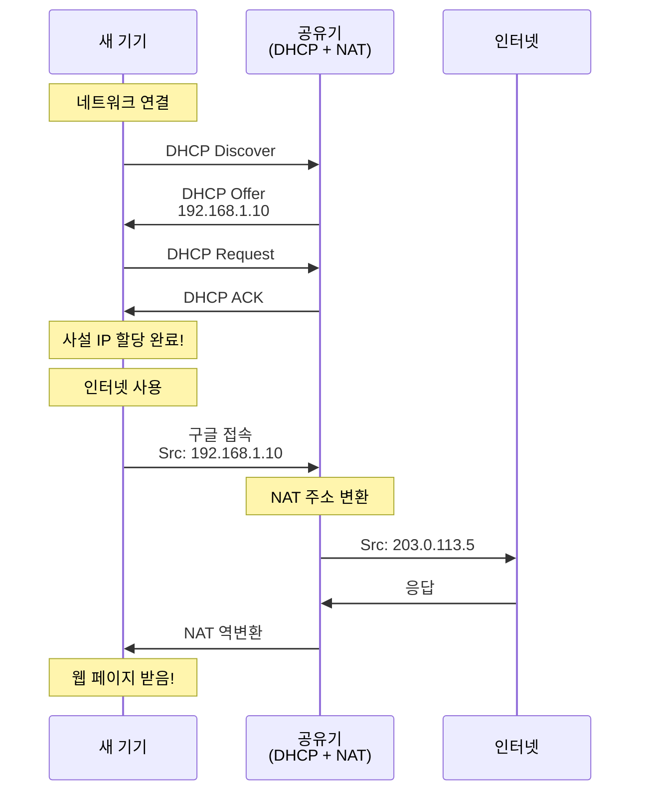

 

**동작 과정:**
1. DHCP로 사설 IP 자동 할당 (192.168.1.10)
2. NAT로 공인 IP로 변환 (203.0.113.5)
3. 인터넷 통신!

 

결국 우리가 집에서 와이파이만 연결하면 자동으로 인터넷이 되는 이유가 바로

**DHCP + NAT** 덕분임!

 

## 실전 예시: 집 네트워크

우리 집의 실제 구조를 보자!

 

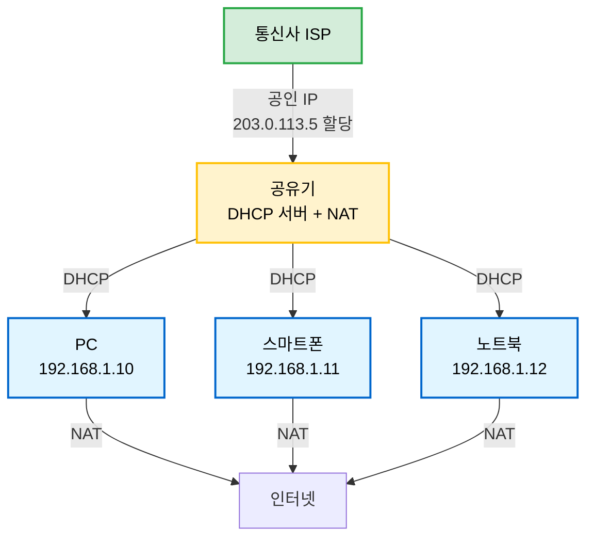

 

1. **통신사가 공유기에게 공인 IP 할당** (1개)
2. **공유기의 DHCP 서버가 각 기기에게 사설 IP 할당**
3. **공유기의 NAT가 사설 IP ↔ 공인 IP 변환**
4. **모든 기기가 하나의 공인 IP로 인터넷 사용!**

 

## NAT 확인하기

### 내 사설 IP 확인

**Windows:**
```bash
ipconfig
```

**macOS/Linux:**
```bash
ifconfig
# 또는
ip addr show
```

 

보통 `192.168.x.x` 형태임!

 

### 내 공인 IP 확인

웹 브라우저에서:
- https://www.whatismyip.com/
- https://ipinfo.io/ip

 

또는 터미널에서:
```bash
curl ifconfig.me
```

 

집 안의 모든 기기가 같은 공인 IP를 보여줌!

NAT 덕분에 하나의 공인 IP 공유하는 거임

 

# 정리

**DHCP 핵심 포인트:**
- IP 주소 **자동 할당** 프로토콜
- **DORA** 4단계 (Discover → Offer → Request → Acknowledge)
- **임대(Lease)** 방식으로 IP 관리
- 네트워크 관리 자동화의 핵심!

 

**NAT 핵심 포인트:**
- **사설 IP ↔ 공인 IP** 변환 기술
- **IPv4 주소 고갈 문제** 해결
- **PAT**(포트 번호 사용)로 N:1 매핑
- 보안 효과도 있음!

 

**DHCP + NAT**
- 우리가 와이파이만 연결하면 자동으로 인터넷 되는 이유
- 공유기 하나로 집 안 모든 기기 인터넷 사용 가능

 

**참고**
- [RFC 2131 - Dynamic Host Configuration Protocol](https://www.rfc-editor.org/rfc/rfc2131)
- [RFC 3022 - Traditional IP Network Address Translator (Traditional NAT)](https://www.rfc-editor.org/rfc/rfc3022)

