안녕하세욥! 

오늘은 네트워크 장비에 대해 공부한걸 정리해 보겠습니답!

네트워크를 공부하다 보면 라우터, 스위치, 브릿지, 허브가 자주 등장함

그리고 타부서에서 "라우터가 어쩌구~" "스위치가 저쩌구~" 하던 얘기를 들은 것 같은데

친숙하지만 두루뭉술한 이것들... 이참에 제대로 공부해보자!

 

# 라우터(Router)

먼저 라우터부터!!

`Route` + `er` 해서 **"길을 찾아주는 것"** 이라는 뜻의 장비임

네트워크 3계층(Network Layer)에서 동작함

 

먼저 간단히 요약해보자면,

**이 장비는 서로 다른 네트워크(`LAN` ↔ `WAN`)를 연결하고, 패킷이 목적지까지 가는 최적의 경로를 결정해주는 기특한 녀석임** 🌟

도착지 식별은 `IP 주소`를 사용함

 

그럼 더 자세하게 알아보자!

 

## 1. 네트워크 간 연결(GateWay 역할)

아래서 다루겠지만 스위치(Switch)는 같은 사무실 안(LAN)끼리만 연결해주지만,

라우터는 내 컴퓨터(LAN)와 인터넷 세상(WAN)을 연결해줌

 

즉, 서로 다른 주소 대역을 사용하는 네트워크들을 이어주는 관문(Gateway) 역할을 하는 것임

 

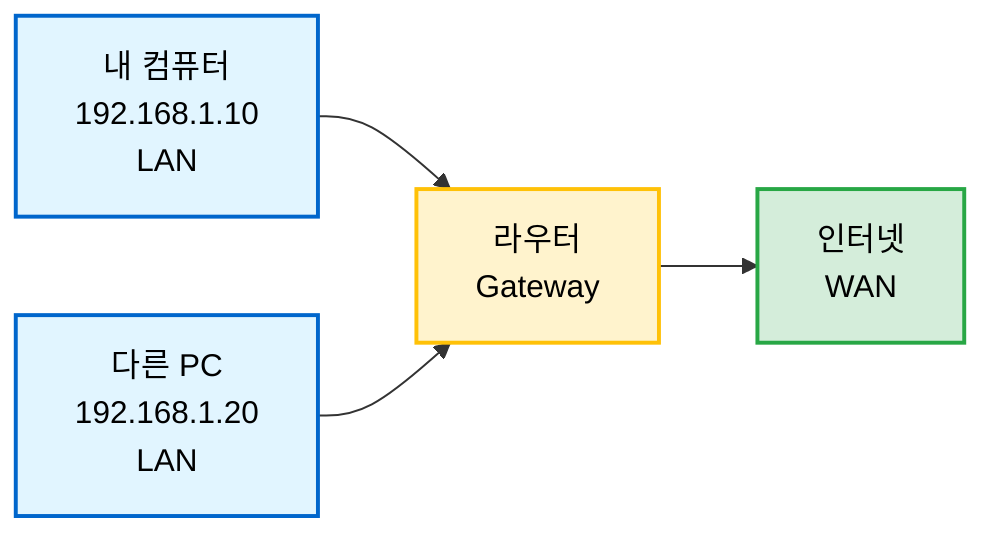

 

## 2. 경로 지정(Routing)

라우터는 **라우팅 테이블(Routing Table)**이라는 라우터의 네비게이션 지도가 있음

이 테이블에는 다음과 같은 정보들이 있음:

 

1. **목적지 네트워크**: 최종 목적지의 주소 대역
2. **서브넷 마스크**: 목적지 IP와 서브넷 마스크를 AND 연산해, 들어온 패킷이 이 줄에 해당되는지 확인
3. **게이트웨이**: 다음 경유지 = 연결된 옆 라우터의 IP 주소
4. **인터페이스**: 게이트웨이를 통해 보내려면 내 어느 포트로 전송해야 하는지
5. **메트릭**: 경로의 비용(기준은 홉 수(거쳐가는 라우터 수), 대역폭, 지연 시간 등)

 

이것들을 사용해 최적의 경로를 찾아줌!

 

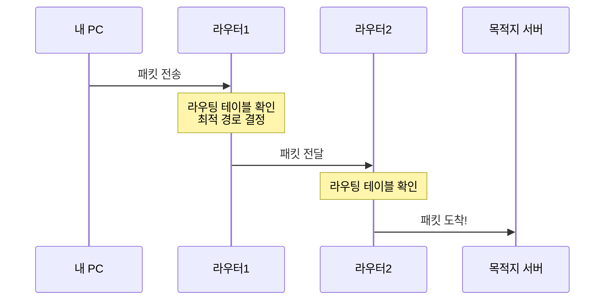

 

## 3. 브로드캐스트 차단

라우터는 네트워크 안에서 발생하는 브로드캐스트 데이터가 외부 네트워크나 다른 대역으로 퍼져나가는 것을 차단함

 

덕분에 불필요한 데이터 전송을 막아 네트워크 병목 현상을 방지함!

 

**브로드캐스트 도메인 분리**

라우터는 브로드캐스트 도메인을 나누는 기준이 됨

라우터를 건너갈 때마다 브로드캐스트가 차단되므로,

네트워크 트래픽이 전 세계로 무분별하게 확산되는 것을 막고 각 네트워크를 독립적으로 유지해줌

 

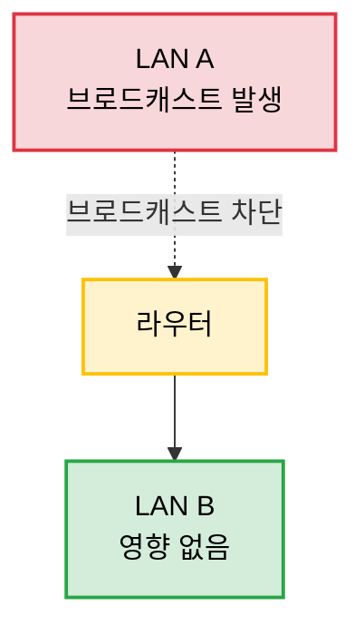

 

 

# 스위치(Switch)

여기서 설명하는 스위치는 `L2` 스위치 기준으로 설명함!

 

**원하는 곳으로만 보내준다**는 뜻을 가진 장비임

네트워크 2계층(Data Link Layer)에서 동작함

 

라우터가 `LAN`과 `WAN`을 연결해주는 장비라면,

스위치는 우리 집 안(LAN)에서 기기들을 연결해줌

때문에 IP 주소 대신 `MAC 주소`(물리적 주소)를 사용함

 

단순히 선만 연결해주는 더미 허브(Dummy Hub)와 다르게,

데이터를 필요한 곳에만 전달해주는 똑똑한 기능이 있음 👀

 

요것도 자세하게 알아보자!

 

## 1. LAN 내부 연결 및 분배

라우터가 서로 다른 네트워크를 연결한다면,

스위치는 같은 네트워크 대역(e.g. 192.168.1.x 내부)에 있는 PC, 프린터, 서버끼리 통신할 수 있게 해줌

 

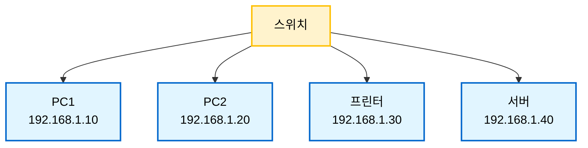

 

## 2. 하드웨어(ASIC) 기반의 빠른 속도

스위치는 **ASIC(Application Specific Integrated Circuit)**이라는 전용 하드웨어 칩셋으로 데이터를 처리함

 

CPU가 머리를 써서 처리하는 게 아니라, 기계적으로 길을 열어주기 때문에 속도가 엄청나게 빠름 🔥

 

## 3. MAC 주소 학습과 전달

라우터와 마찬가지로 스위치도 테이블이 있음

바로 **MAC 주소 테이블**임!

 

스위치의 3가지 동작 방식:

 

**러닝(Learning)**

A라는 PC가 데이터를 보내면, 스위치는 "어? A가 1번 포트에 꽂혀있네?" 하고 족보에 적어둠

(Src MAC 주소 학습)

 

**포워딩(Forwarding)**

누군가 A에게 데이터를 보낼 때, 스위치는 족보를 보고

"A는 1번 포트에 있으니까 1번으로만 보내줘야지" 하고 정확하게 배달함

 

**플러딩(Flooding)**

만약 족보에 없는 새로운 목적지거나, 전체에게 보내야 하는(브로드캐스트) 데이터라면?

이때는 연결된 모든 포트에 뿌려서 주인을 찾음

(이 점이 브로드캐스트를 막아버리는 라우터와 다름!)

 

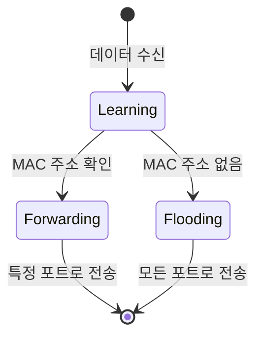

 

## 4. 충돌 영역 분리

스위치는 각 포트마다 전용 차선을 만들어줌

 

즉, 1번 포트와 2번 포트가 통신하는 동안,

3번 포트와 4번 포트도 동시에 통신할 수 있음!

 

### L3, L4, L7 스위치?는 다음 시간에…

(나중에 링크 추가 예정 ㅎㅎ)

 

 

# 브릿지(Bridge)

브릿지도 2계층(Data Link Layer)에 속하는 장비임

 

요놈은 끊어진 두 개의 LAN을 하나로 연결해주는 **다리 역할**을 함

그런데 단순히 연결만 하는게 아니라 나름의 규칙으로 통신을 제어함

 

## 1. 네트워크 확장과 연결

물리적으로 떨어져 있는 A 사무실과 B 사무실의 네트워크를 연결해,

마치 하나의 네트워크처럼 동작하게 해줌

 

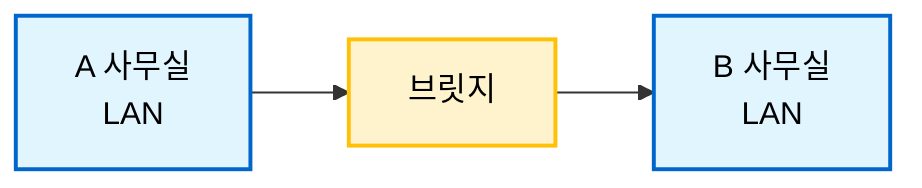

 

## 2. 트래픽 제어 (Filtering & Forwarding)

브릿지는 다리 중간에 서 있는 검문소와 같음

 

**필터링(Filtering)**

A 사무실 안에서끼리 주고받는 데이터는 굳이 다리를 건너 B 사무실로 갈 필요가 없음

브릿지는 이걸 파악해서 다리를 못 건너게 막음 (불필요한 트래픽 차단)

 

**포워딩(Forwarding)**

반대로 A 사무실에서 B 사무실로 보내는 데이터만 확인해서 다리를 건너게 해줌

 

덕분에 양쪽 네트워크의 충돌을 줄여줌!

 

## 3. 브로드캐스트 전달

중요한 점은,

브릿지는 특정 목적지로 가는 데이터(Unicast)는 막거나 보내주지만,

"모두 들어라!" 하는 브로드캐스트 데이터는 막지 않고 다리를 건너게 해줌

 

그래서 브릿지로 연결된 네트워크들은 하나의 브로드캐스트 도메인이 되는 것임

 

## 4. 스위치와의 관계 (왜 요즘은 안 보일까?)

"어? 기능만 보면 스위치랑 똑같은데?" 

맞음!! 논리적인 기능은 같음

하지만 처리 방식이 다름

 

|        | 브릿지                                   | 스위치                                |
|--------|----------------------------------------|-------------------------------------|
| 처리방식 | CPU(소프트웨어)가 하나하나 검사           | ASIC(하드웨어 칩)이 기계적으로 처리      |
| 속도    | 느림 (사람이 직접 검문)                   | 빠름 (하이패스처럼 통과)                |
| 포트수  | 적음 (보통 2~4개)                        | 많음 (수십~수백 개)                    |

 

결국, **브릿지를 하드웨어적으로 업그레이드해서 포트를 왕창 늘린 것이 바로 스위치(Switch)임**

그래서 요즘은 브릿지라는 용어를 거의 안 쓰고, 그냥 스위치라고 부르는 것 ㅎㅎ

 

 

# 허브(Hub)

마지막으로 허브에 대해 알아보자!

 

허브는 네트워크 장비 중에서 가장 단순하고 원시적인 장비임

1계층(Physical Layer)에서 동작함

 

## 1. 더미 허브(Dummy Hub) - 멍청한 집중 장치

더미 허브는 정말 말 그대로 "멍청한" 장비임

 

여러 대의 컴퓨터를 연결할 수 있는 포트가 있는데,

한 포트로 들어온 데이터를 **아무 생각 없이** 나머지 모든 포트로 뿌려버림 📡

 

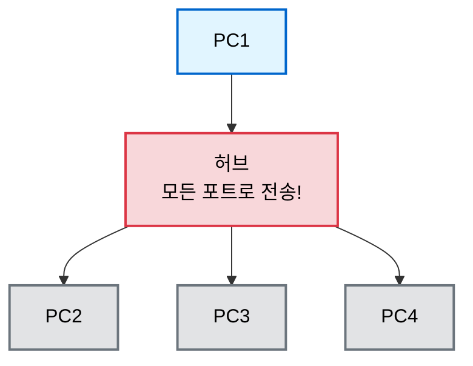

 

예를 들어 PC1이 PC2에게만 데이터를 보내고 싶어도,

허브는 PC3, PC4에게도 똑같이 보내버림!

 

그럼 PC3, PC4는 "어? 이거 내꺼 아닌데?" 하고 버리는 것임

(엄청난 낭비잖아...? ㅠㅠ)

 

### 동작 방식

1. **전기 신호 증폭**: 들어온 신호를 단순히 증폭해서 복사
2. **전체 브로드캐스트**: 수신 포트를 제외한 모든 포트로 전송
3. **주소 인식 불가**: MAC 주소도, IP 주소도 모름. 그냥 전기 신호만 봄

 

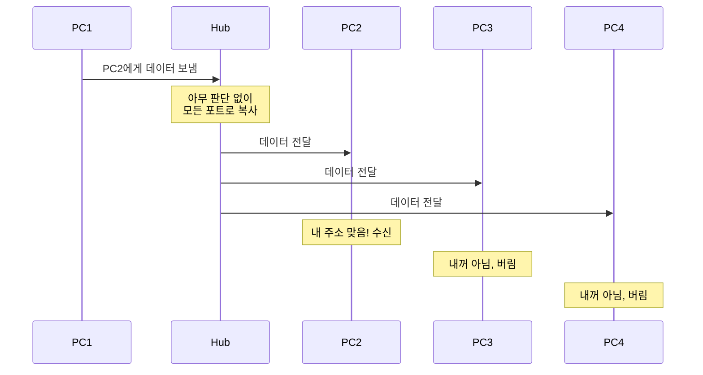

 

## 2. 인텔리전트 허브(Intelligent Hub)

더미 허브보다 조금 똑똑한 버전도 있었음

 

포트별 통계나 관리 기능이 있긴 한데,

결국 데이터 전달 방식은 더미 허브랑 똑같음 (모든 포트로 뿌림)

 

그냥 관리자가 모니터링하기 편한 정도의 차이임

 

## 3. 허브의 치명적인 문제들 🌚

### 문제 1: 충돌 도메인(Collision Domain)

허브에 연결된 모든 기기는 **하나의 충돌 도메인**을 공유함

 

즉, PC1과 PC2가 통신 중일 때,

PC3과 PC4는 절대 통신할 수 없음!

 

왜냐면 같은 전선을 공유하는 거라서, 동시에 데이터를 보내면 충돌(Collision)이 일어나기 때문

 

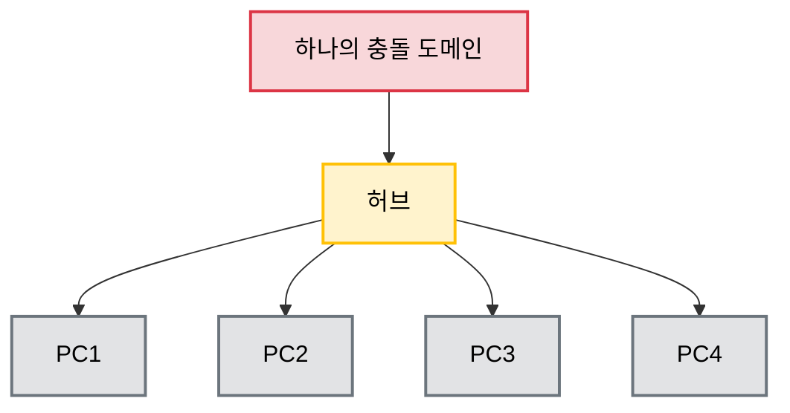

 

### 문제 2: 반이중 통신(Half-Duplex)

허브는 **한 번에 한 방향으로만** 데이터를 보낼 수 있음

 

송신 중에는 수신 못하고, 수신 중에는 송신 못함

(마치 무전기처럼 "오버~" 하고 교대로 말해야 하는 것)

 

### 문제 3: 보안 문제

모든 데이터가 모든 포트로 가니까,

네트워크 분석 도구만 있으면 다른 사람의 통신 내용을 엿볼 수 있음! 😱

 

### 문제 4: 대역폭 공유

허브가 100Mbps를 지원한다고 해도,

4대가 연결되어 있으면 실질적으로 한 대당 25Mbps밖에 못 씀

(물론 이론적인 최대치이고 실제로는 충돌 때문에 더 느림)

 

## 4. 허브 vs 스위치 - 왜 허브는 사라졌을까?

|              | 허브(Hub)                | 스위치(Switch)          |
|--------------|-------------------------|------------------------|
| **OSI 계층**  | 1계층 (Physical)        | 2계층 (Data Link)      |
| **전달 방식**  | 모든 포트로 브로드캐스트    | 목적지 포트로만 전송      |
| **주소 인식**  | 불가능 (그냥 전기 신호)    | MAC 주소 인식           |
| **충돌 도메인** | 전체가 하나의 도메인       | 포트별로 분리            |
| **통신 방식**  | 반이중(Half-Duplex)      | 전이중(Full-Duplex) 가능 |
| **대역폭**    | 모두가 공유              | 포트별 전용              |
| **보안**      | 매우 취약 ⚠️            | 상대적으로 안전 ✅        |
| **가격**      | 저렴                    | 예전엔 비쌌지만 지금은 저렴|

 

결국 스위치 가격이 내려가면서, 허브는 완전히 도태되었음

 

요즘은 허브를 찾아보기도 힘들고, 있어도 굳이 살 이유가 없음 ㅎㅎ

 

## 5. 그래도 허브를 쓸 때가 있다?

사실상 실무에서는 거의 안 쓰지만,

 

**네트워크 트래픽 모니터링**을 할 때 의도적으로 허브를 사용하기도 함!

 

모든 데이터가 모든 포트로 가는 특성을 이용해서,

한 포트에 패킷 분석 장비를 연결하면 전체 트래픽을 캡처할 수 있기 때문

 

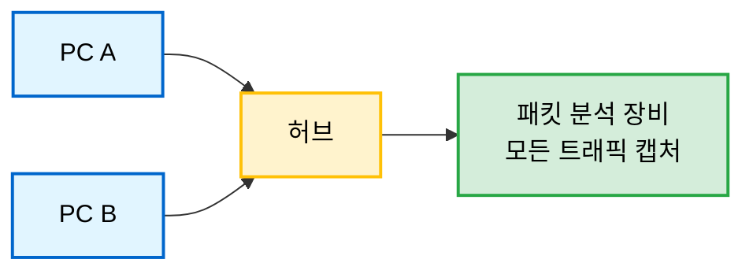

 

하지만 이것도 요즘은 스위치의 **포트 미러링(Port Mirroring)** 기능으로 대체됨!

 

 

# 비교 정리

자, 그럼 세 장비를 한눈에 정리해보자!

 

|              | 라우터(Router)        | 스위치(Switch)      | 브릿지(Bridge)      | 허브(Hub)          |
|--------------|----------------------|-------------------|-------------------|--------------------|
| **OSI 계층**  | 3계층 (Network)      | 2계층 (Data Link)  | 2계층 (Data Link)  | 1계층 (Physical)    |
| **주소 사용**  | IP 주소              | MAC 주소           | MAC 주소           | 주소 인식 불가       |
| **주요 역할**  | 네트워크 간 연결, 경로 결정 | LAN 내부 기기 연결    | 두 LAN 연결        | 단순 신호 증폭/분배   |
| **브로드캐스트** | 차단 🚫             | 전달 ✅            | 전달 ✅            | 무조건 전체 전송 📡   |
| **처리 방식**  | 소프트웨어/하드웨어    | 하드웨어 (ASIC)     | 소프트웨어 (CPU)    | 전기 신호만 증폭      |
| **충돌 도메인** | 분리                 | 포트별 분리 ✅      | 분리               | 전체가 하나 ⚠️      |
| **속도**      | 중간                 | 빠름 🔥           | 느림               | 매우 느림 (충돌多)    |
| **현재 사용**  | 필수 장비            | 필수 장비          | 거의 안씀           | 사실상 퇴출 ❌       |

 

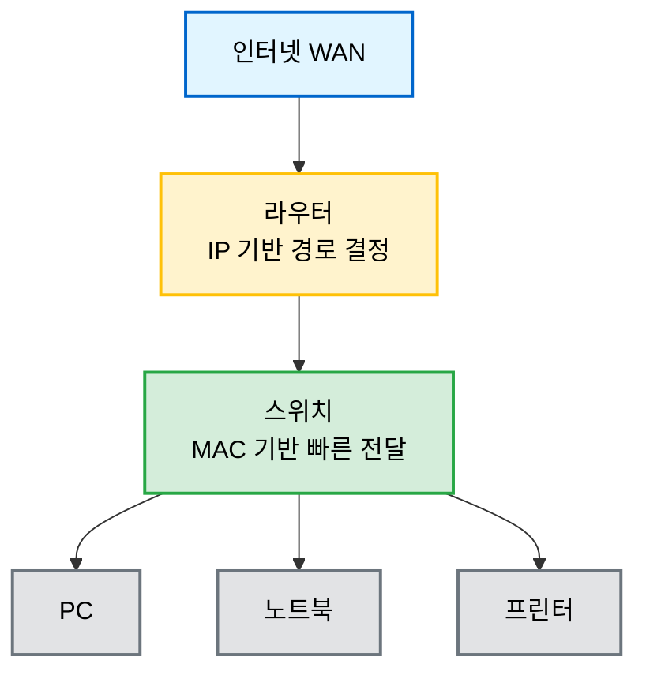

 

네트워크 데이터가 흐르는 과정을 보면:

 

1. **인터넷 → 라우터**: IP 주소를 보고 어느 네트워크로 보낼지 결정
2. **라우터 → 스위치**: 해당 네트워크 내부로 데이터 전달
3. **스위치 → 기기**: MAC 주소를 보고 정확한 기기로 배달

 

이렇게 각자의 역할이 명확하게 나뉘어져 있음!

 

 

.

.

.

오늘은 네트워크의 핵심 장비인 라우터, 스위치, 브릿지, 허브에 대해 알아봤음

평소에 자주 듣던 용어들인데, 막상 정확한 역할과 차이점을 몰랐었는데

이번 기회에 제대로 정리하니까 뿌듯함 ㅎㅎ

 

특히 **네트워크 장비의 발전 과정**이 보이는 게 재밌었음:

허브(멍청하게 다 뿌림) → 브릿지(조금 생각함) → 스위치(하드웨어로 빠르게 처리) → 라우터(네트워크 간 연결)

 

요즘은 허브랑 브릿지를 거의 안 쓰는 이유도 명확해졌고!

 

다음엔 L3, L4, L7 스위치에 대해서도 정리해봐야겠음 👀
