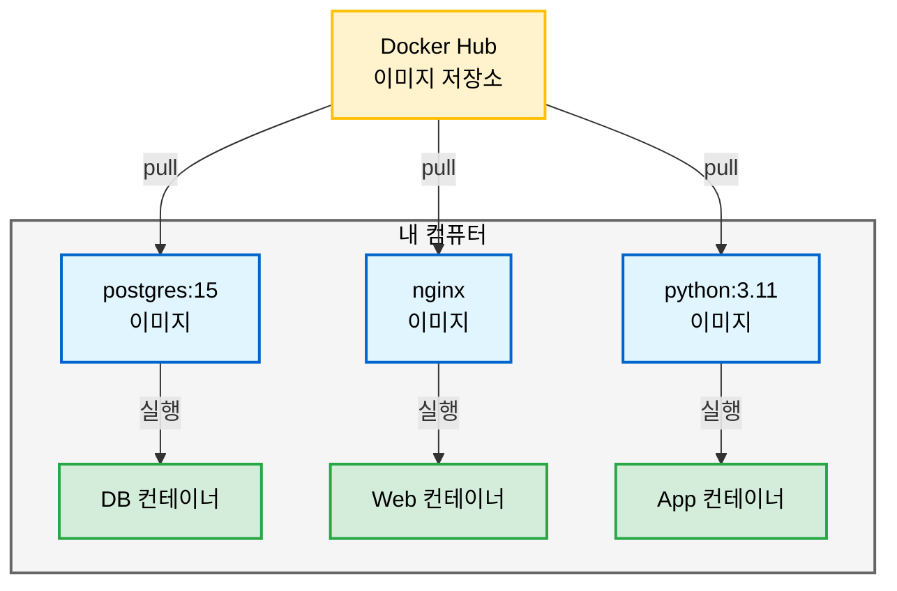
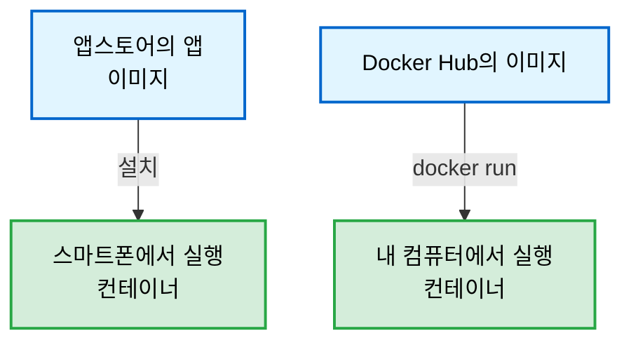
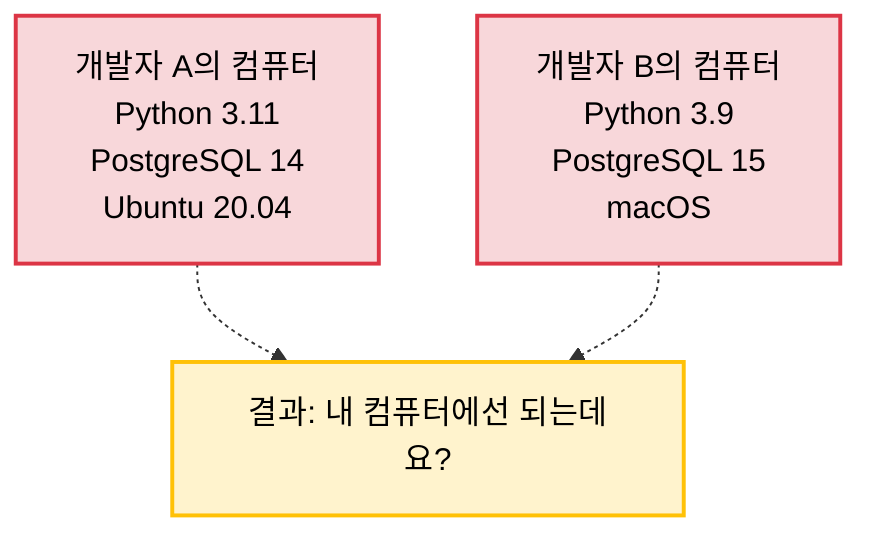
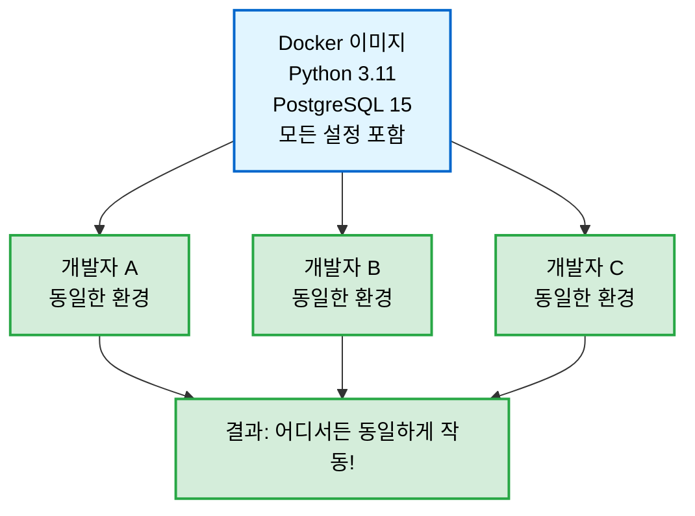
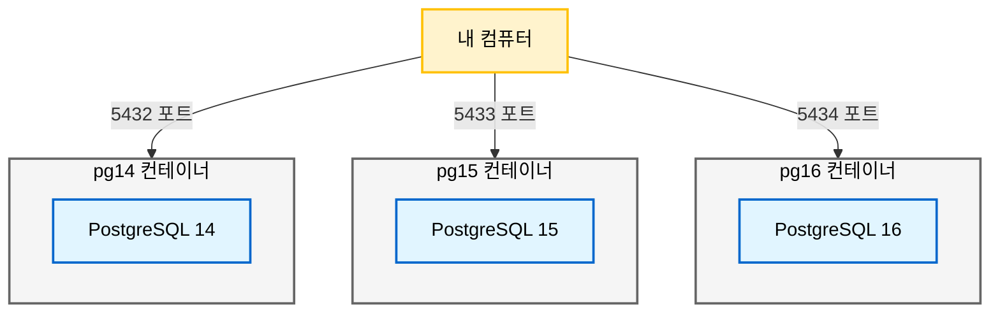
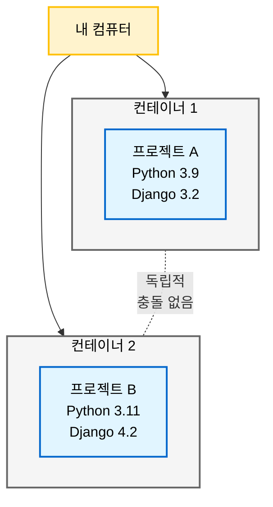
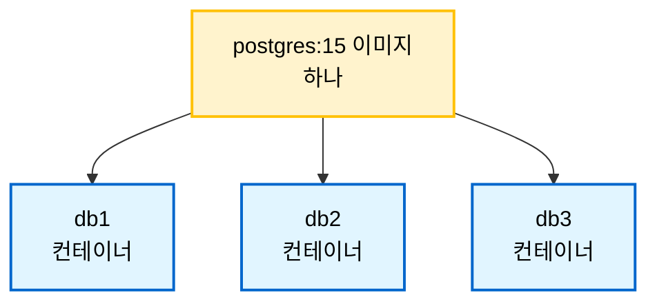
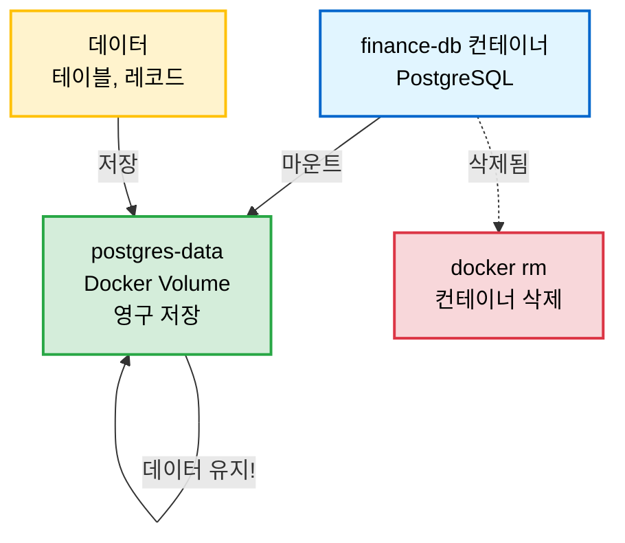

오늘은 Docker 기초를 공부한 내용을 정리해봄

개발하다 보면 "내 컴퓨터에선 되는데요?"라는 말을 정말 많이 듣게 됨

Docker를 사용하면 이런 문제를 해결할 수 있음

 

# Docker란 무엇인가

## 정의

Docker는 **애플리케이션을 컨테이너라는 독립된 환경에 담아 실행할 수 있게 해주는 플랫폼**

 



 

## 비유로 이해하기

### 이삿짐 박스 비유

```
현실 세계의 이사:
- 집마다 구조가 다름 (내 컴퓨터 vs 서버 컴퓨터)
- 가구 배치가 달라질 수 있음 (프로그램 설치 환경)

Docker 사용:
- 박스 안에 모든 것을 담음 (앱 + 필요한 모든 파일)
- 어디에 두든 똑같이 작동 (내 PC든 AWS든 동일)
```

 

### 스마트폰 앱 비유



 

# Docker가 필요한 이유

## 환경 일관성 문제 해결

### Docker 없이 개발하면



 

### Docker 사용하면



 

## 설치/삭제 간편함

### 기존 방식 (복잡함)

```bash
# PostgreSQL 설치 (복잡한 과정)
1. 공식 사이트에서 다운로드
2. 설치 마법사 따라가기
3. 환경 변수 설정
4. PATH 설정
5. 서비스 등록
6. 설정 파일 수정

# 삭제 (더 복잡)
- 파일이 여기저기 흩어짐
- 완전히 삭제하기 어려움
```

 

### Docker 방식 (간단함)

```bash
# PostgreSQL 설치 및 실행 (1줄)
docker run -d --name my-db -p 5432:5432 postgres:15

# 삭제 (2줄)
docker stop my-db
docker rm my-db
```

 

이게 Docker의 가장 큰 장점임!

30분 걸리던 설치가 1분으로 단축됨

 

## 여러 버전 동시 사용

```bash
# PostgreSQL 14, 15, 16 동시 실행 가능
docker run -d -p 5432:5432 --name pg14 postgres:14
docker run -d -p 5433:5432 --name pg15 postgres:15
docker run -d -p 5434:5432 --name pg16 postgres:16

# 기존 방식으로는 거의 불가능!
```

 



 

버전별 테스트가 필요할 때 정말 유용함

 

## 독립적인 환경



 

각 프로젝트가 서로 영향을 주지 않음

 

## 실무에서의 장점


 

# 핵심 개념

## 이미지 vs 컨테이너

### 이미지 (Image)

```
정의: 프로그램 설치 파일

특징:
- 읽기 전용 (변경 불가)
- 한 번 만들면 재사용 가능
- Docker Hub에서 다운로드 가능

비유:
- 게임 설치 파일
- 앱스토어의 앱
- 음악 CD (원본)
```

 

### 컨테이너 (Container)

```
정의: 이미지를 실행한 것

특징:
- 읽기/쓰기 가능
- 각각 독립적
- 하나의 이미지로 여러 컨테이너 생성 가능

비유:
- 게임 실행 (여러 세이브 파일)
- 설치한 앱
- CD를 플레이어에 넣어 재생
```

 

### 관계도



 

이게 이미지와 컨테이너의 핵심 차이점임!

 

## Docker 주요 옵션

```bash
docker run -d \              # 백그라운드 실행
  --name finance-db \        # 컨테이너 이름
  -e POSTGRES_DB=finance_db \ # 환경 변수 (초기 설정)
  -p 5432:5432 \             # 포트 연결 (내PC:컨테이너)
  postgres:15                # 이미지:버전
```

 

### 옵션 상세 설명

| 옵션 | 의미 | 비유 |
|------|------|------|
| `-d` | detached (백그라운드) | 음악을 백그라운드에서 재생 |
| `--name` | 컨테이너 이름 지정 | 강아지 이름 짓기 |
| `-e` | environment (환경 변수) | 스마트폰 초기 설정 |
| `-p` | port (포트 연결) | 호텔 정문 → 객실 연결 |
| `이미지:태그` | 사용할 이미지와 버전 | 앱 이름과 버전 |

 

## 데이터 영속성

### docker stop/start (데이터 유지)

```bash
docker stop finance-db
  → 컨테이너 멈춤
  → 데이터 유지
  
docker start finance-db
  → 컨테이너 재시작
  → 데이터 그대로 로드

비유: 컴퓨터 끄고 켜기 (파일은 하드디스크에 그대로)
```

 

### docker rm (데이터 삭제)

```bash
docker rm finance-db
  → 컨테이너 삭제
  → 데이터도 삭제

비유: 하드디스크 포맷 (모든 파일 삭제)
```

 

### Volume (영구 저장)

```bash
# Volume 생성 및 사용
docker volume create postgres-data

docker run -d \
  --name finance-db \
  -v postgres-data:/var/lib/postgresql/data \
  postgres:15

# 이제 docker rm 해도 데이터 유지!
```

 



 

Volume을 사용하면 컨테이너를 삭제해도 데이터가 보존됨

실무에서는 거의 필수로 사용함!

 

# Docker 설치 및 실습

## Docker 설치

```bash
# macOS (Homebrew)
brew install --cask docker

# Docker Desktop 실행
open /Applications/Docker.app

# 설치 확인
docker --version
# 출력: Docker version 24.0.7

# Hello World 실행
docker run hello-world
# 출력: Hello from Docker!
```

 

Windows는 Docker Desktop 공식 사이트에서 다운로드하면 됨

 

## PostgreSQL 컨테이너 실행

```bash
# PostgreSQL 15 버전 컨테이너 실행
docker run -d \
  --name finance-db \
  -e POSTGRES_DB=finance_db \
  -e POSTGRES_USER=admin \
  -e POSTGRES_PASSWORD=secret123 \
  -p 5432:5432 \
  postgres:15

# 실행 확인
docker ps
```

 

**출력:**
```
CONTAINER ID   IMAGE         STATUS        PORTS                    NAMES
a3b4c5d6e7f8   postgres:15   Up 10 seconds 0.0.0.0:5432->5432/tcp   finance-db
```

 

단 1분 만에 PostgreSQL 설치 및 실행 완료!

 

## PostgreSQL 접속 및 SQL 실습

### 접속

```bash
docker exec -it finance-db psql -U admin -d finance_db
```

 

### 테이블 생성

```sql
CREATE TABLE test (
    id SERIAL PRIMARY KEY,
    message VARCHAR(100)
);
```

**출력:** `CREATE TABLE`

 

### 데이터 입력

```sql
INSERT INTO test (message) VALUES ('Hello Docker!');
INSERT INTO test (message) VALUES ('PostgreSQL is working!');
```

**출력:** `INSERT 0 1`

 

### 데이터 조회

```sql
SELECT * FROM test;
```

**출력:**
```
 id |        message         
----+------------------------
  1 | Hello Docker!
  2 | PostgreSQL is working!
(2 rows)
```

 

### 데이터 수정

```sql
UPDATE test SET message = 'Hello from Docker!' WHERE id = 1;
```

 

### PostgreSQL 나가기

```sql
\q
```

 

## 컨테이너 생명주기 관리

### 컨테이너 중지

```bash
docker stop finance-db

# 확인
docker ps        # 아무것도 안 보임
docker ps -a     # finance-db가 Exited 상태
```

 

### 컨테이너 재시작

```bash
docker start finance-db

# 확인
docker ps        # finance-db가 Up 상태
```

 

### 데이터 영속성 확인

```bash
# 다시 접속
docker exec -it finance-db psql -U admin -d finance_db

# 데이터 확인
SELECT * FROM test;

# 출력: 데이터 그대로!
#  id |        message         
# ----+------------------------
#   1 | Hello from Docker!
#   2 | PostgreSQL is working!
```

 

**컨테이너를 껐다 켜도 데이터 유지됨!**

이게 Docker의 또 다른 장점임

 

## nginx 웹서버 실습

```bash
# nginx 컨테이너 실행
docker run -d -p 8080:80 --name my-web nginx

# 브라우저에서 확인
# http://localhost:8080
```

**결과:**

 

```bash
# 정리
docker stop my-web
docker rm my-web
```

 

nginx도 1줄로 설치 완료!

 

# Docker 명령어 정리

## 컨테이너 관리

```bash
# 컨테이너 실행
docker run [옵션] 이미지명

# 실행 중인 컨테이너 보기
docker ps

# 모든 컨테이너 보기 (중지된 것 포함)
docker ps -a

# 컨테이너 시작
docker start 컨테이너명

# 컨테이너 중지
docker stop 컨테이너명

# 컨테이너 재시작
docker restart 컨테이너명

# 컨테이너 삭제
docker rm 컨테이너명

# 컨테이너 강제 삭제 (실행 중이어도)
docker rm -f 컨테이너명
```

 

## 이미지 관리

```bash
# 이미지 목록 보기
docker images

# 이미지 다운로드
docker pull 이미지명:태그

# 이미지 삭제
docker rmi 이미지명:태그
```

 

## 정보 확인

```bash
# 컨테이너 로그 보기
docker logs 컨테이너명

# 마지막 N줄만 보기
docker logs --tail 20 컨테이너명

# 실시간 로그 (Ctrl+C로 종료)
docker logs -f 컨테이너명

# 컨테이너 상세 정보
docker inspect 컨테이너명

# Docker 시스템 정보
docker system df
```

 

## 컨테이너 접속

```bash
# 컨테이너 내부로 들어가기
docker exec -it 컨테이너명 bash

# 컨테이너에서 명령어 실행
docker exec 컨테이너명 명령어

# 예시
docker exec finance-db psql -U admin -d finance_db
```

 

## 정리

```bash
# 중지된 컨테이너 모두 삭제
docker container prune

# 사용하지 않는 이미지 삭제
docker image prune

# 전체 정리 (주의!)
docker system prune -a
```

 

# PostgreSQL 관련 명령어

## 접속

```bash
# 기본 접속
docker exec -it finance-db psql -U admin -d finance_db

# 명령어만 실행하고 나가기
docker exec finance-db psql -U admin -d finance_db -c "SELECT * FROM test;"
```

 

## SQL 기본 명령어

```sql
-- 테이블 생성
CREATE TABLE 테이블명 (
    컬럼명 타입 제약조건
);

-- 데이터 입력
INSERT INTO 테이블명 (컬럼1, 컬럼2) VALUES (값1, 값2);

-- 데이터 조회
SELECT * FROM 테이블명;
SELECT 컬럼명 FROM 테이블명 WHERE 조건;

-- 데이터 수정
UPDATE 테이블명 SET 컬럼명 = 값 WHERE 조건;

-- 데이터 삭제
DELETE FROM 테이블명 WHERE 조건;

-- 테이블 삭제
DROP TABLE 테이블명;
```

 

## PostgreSQL 유틸리티 명령어

```sql
\q              -- 나가기
\l              -- 데이터베이스 목록
\c 데이터베이스명  -- 데이터베이스 전환
\dt             -- 테이블 목록
\d 테이블명      -- 테이블 구조 보기
\du             -- 사용자 목록
\?              -- 도움말
```


# 정리

오늘 Docker 기초를 공부하면서 느낀 점

 

**Docker 핵심 포인트:**
- **이미지 ≠ 컨테이너** - 이미지는 설치 파일, 컨테이너는 실행 중인 프로그램
- **환경 일관성** - 개발/테스트/배포 환경이 완전히 동일
- **빠른 설치** - 30분 걸리던 PostgreSQL 설치가 1분으로 단축
- **독립적 실행** - 여러 버전 동시 사용 가능 (postgres:14, 15, 16 동시 실행)
- **데이터 영속성** - stop/start는 데이터 유지, rm은 삭제

 

**배운 내용:**
1. Docker 설치 및 기본 개념
2. PostgreSQL 컨테이너 실행 및 접속
3. SQL 기본 명령어 (CREATE, INSERT, SELECT, UPDATE)
4. 컨테이너 생명주기 관리 (start/stop/restart)
5. Volume을 통한 데이터 영구 저장
6. nginx 웹서버 실행
7. Docker 주요 옵션 (-d, --name, -e, -p, -v)

 

**자주 쓰는 명령어:**
```bash
# 컨테이너 실행 및 관리
docker run          # 컨테이너 실행
docker ps           # 실행 중인 컨테이너 확인
docker ps -a        # 모든 컨테이너 확인
docker stop/start   # 컨테이너 중지/시작
docker rm           # 컨테이너 삭제

# 정보 확인
docker logs         # 로그 확인
docker exec         # 컨테이너 내부 접속
docker images       # 이미지 목록

# Volume
docker volume create    # Volume 생성
docker volume ls        # Volume 목록
```

 

**실전에서 활용법:**
- PostgreSQL, MySQL 등 DB를 로컬에서 간편하게 테스트
- 여러 버전의 소프트웨어 동시 실행 및 테스트
- Volume으로 데이터 백업 및 복구
- 팀원들과 동일한 개발 환경 공유

 

Docker를 사용하면 개발 환경 구축이 정말 간편해짐

"내 컴퓨터에선 되는데"라는 말을 이제 안 듣게 될 거임

 

앞으로는 Docker Compose, 네트워크, Dockerfile 같은 심화 내용도 학습해봐야겠음

 

**참고 자료**
- [Docker 공식 문서](https://docs.docker.com/)
- [Docker Hub](https://hub.docker.com/)
- [PostgreSQL Docker Hub](https://hub.docker.com/_/postgres)
- [nginx Docker Hub](https://hub.docker.com/_/nginx)
